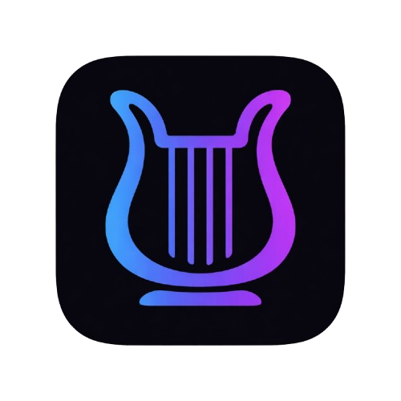

<div align="center">
  

  <h1>LyraNote</h1>

  <p><strong>AI 驱动的第二大脑 — 真正与你的知识对话，而不只是存储它。</strong></p>

[English](./README.md) · **简体中文**

[![][github-contributors-shield]][github-contributors-link]
[![][github-forks-shield]][github-forks-link]
[![][github-stars-shield]][github-stars-link]
[![][github-issues-shield]][github-issues-link]
[![][github-license-shield]][github-license-link]

</div>

<details>
<summary><kbd>目录</kbd></summary>

#### TOC

- [👋 项目简介](#-项目简介)
- [✨ 功能特性](#-功能特性)
  - [知识管理](#知识管理)
  - [AI 助手](#ai-助手)
  - [富文本笔记编辑](#富文本笔记编辑)
  - [智能自动化](#智能自动化)
- [🛠 技术栈](#-技术栈)
- [🏗 系统架构](#-系统架构)
- [🛳 部署](#-部署)
  - [方式一 — 本地开发](#方式一--本地开发)
  - [方式二 — Docker Compose（全栈一体）](#方式二--docker-compose全栈一体)
  - [方式三 — 前端 Vercel + 后端服务器](#方式三--前端-vercel--后端服务器)
- [⚙️ 环境变量](#️-环境变量)
- [⌨️ 快速启动](#️-快速启动)
- [🤝 贡献](#-贡献)
- [📈 Star 趋势](#-star-趋势)

####

<br/>

</details>

<br/>

## 👋 项目简介

**LyraNote** 是一款现代 AI 驱动的个人知识管理应用，旨在成为你的「第二大脑」。通过将 RAG 检索增强生成、多步骤 AI Agent、知识图谱与长期记忆融为一体，LyraNote 让你真正*与自己的知识库对话*——而不只是在其中检索。

---

## ✨ 功能特性

### 知识管理

- **多格式来源导入** — 支持 PDF 文件、网页 URL、Markdown 文本，自动解析、分块、向量化入库。
- **RAG 对话** — AI 基于笔记本内的知识库进行检索增强回答，并附带来源引用。
- **知识图谱** — 自动从来源中提取实体与关系，生成可交互的力导向图谱。

### AI 助手

- **流式 AI 对话** — 实时 SSE 流式输出，支持多轮上下文对话。
- **深度研究 Agent** — 多步骤自主研究，联网搜索并输出结构化研究报告。
- **AI 副驾驶** — 悬浮于编辑器旁的 AI 面板，始终感知当前笔记本内容。
- **内联幽灵文字** — 编辑时 AI 实时显示建议，按 `Tab` 一键接受。
- **AI 生成内容** — 一键生成摘要、FAQ、学习指南、简报等结构化文档。

### 富文本笔记编辑

- **富文本编辑器** — 基于 Tiptap，支持 Markdown 快捷键、标题、列表、代码块、引用等。
- **自动保存** — 编辑内容实时同步至后端。
- **公开分享** — 笔记本可生成只读公开链接。

### 智能自动化

- **长期记忆** — AI 跨会话记忆用户偏好与知识点，持续个性化。
- **场景感知** — 自动识别对话场景（研究 / 写作 / 学习 / 复习）并切换策略。
- **思维导图** — AI 对话中实时渲染思维导图。
- **定时任务** — 创建 Cron 自动化任务（每日新闻摘要、知识简报等），通过邮件推送。
- **主动洞察** — AI 主动推送与当前内容相关的洞察卡片。

---

## 🛠 技术栈

### 前端（`web/`）

| 技术 | 用途 |
|---|---|
| [Next.js 15](https://nextjs.org/)（App Router） | React 全栈框架 |
| [React 19](https://react.dev/) + TypeScript | UI 开发 |
| [Tailwind CSS](https://tailwindcss.com/) | 原子化样式 |
| [Tiptap](https://tiptap.dev/) | 富文本编辑器 |
| [TanStack Query](https://tanstack.com/query) | 服务端状态与缓存 |
| [Zustand](https://zustand-demo.pmnd.rs/) | 客户端全局状态 |
| [Framer Motion](https://www.framer.com/motion/) | 动画 |
| [react-force-graph-2d](https://github.com/vasturiano/react-force-graph) | 知识图谱可视化 |
| [markmap](https://markmap.js.org/) | 思维导图渲染 |
| [next-intl](https://next-intl-docs.vercel.app/) | 国际化（i18n） |

### 后端（`api/`）

| 技术 | 用途 |
|---|---|
| Python 3.12 + [FastAPI](https://fastapi.tiangolo.com/) | 异步 Web 框架 |
| SQLAlchemy 2.0 + asyncpg | 异步 ORM |
| Alembic | 数据库迁移 |
| PostgreSQL 16 + pgvector | 关系数据 + 向量相似度检索 |
| Celery + Redis | 后台异步任务队列 |
| OpenAI SDK | LLM 调用与文本嵌入 |
| [LangGraph](https://www.langchain.com/langgraph) | 多步骤 Agent 编排 |
| MinIO / S3 | 文件对象存储 |
| Tavily API | 网络搜索工具 |

---

## 🏗 系统架构

```
┌─────────────────────────────────────────────────────────────────┐
│                        用户浏览器                                │
│           Next.js 15 前端 (React 19 + Tiptap + Zustand)         │
└──────────────────────────────┬──────────────────────────────────┘
                               │ HTTP / SSE
┌──────────────────────────────▼──────────────────────────────────┐
│                    FastAPI 后端 (Python 3.12)                    │
│   ┌─────────────┐  ┌──────────────┐  ┌───────────────────────┐  │
│   │  REST API   │  │  SSE 流式    │  │    Celery Worker      │  │
│   │   路由层    │  │  AI 对话     │  │  （后台 AI 任务）      │  │
│   └──────┬──────┘  └──────┬───────┘  └──────────┬────────────┘  │
│          │                │                     │               │
│   ┌──────▼────────────────▼─────────────────────▼────────────┐  │
│   │                   Agent / Skills 层                       │  │
│   │  ReAct Agent · RAG · 深度研究 · 记忆 · 知识图谱 · 写作    │  │
│   └──────────────────────────────────────────────────────────┘  │
└──────────────────────────────────────────────────────────────────┘
         │                    │                    │
┌────────▼──────┐   ┌─────────▼────────┐   ┌──────▼───────────┐
│  PostgreSQL   │   │      Redis       │   │   MinIO / S3     │
│  + pgvector   │   │  (Celery Broker  │   │  (文件对象存储)   │
│  (数据 + 向量) │   │   + 缓存)        │   │                  │
└───────────────┘   └──────────────────┘   └──────────────────┘
```

---

## 🛳 部署

### 方式一 — 本地开发

适合需要热重载调试的场景。数据层（PostgreSQL + Redis）通过 Docker 自动管理，应用层在本地进程中运行。

```bash
cp api/.env.example api/.env
# 至少填写 JWT_SECRET

./start.sh local
```

脚本会自动：检测/启动数据库容器 → 创建 Python 虚拟环境 → 安装依赖 → 执行数据库迁移 → 并行启动 FastAPI、Celery Worker 和 Next.js Dev Server。

按 `Ctrl+C` 停止本地进程，数据库容器不受影响。

---

### 方式二 — Docker Compose（全栈一体）

前端、后端、Worker 及所有基础设施全部运行在容器中，适合快速预览或服务器自托管。

**1. 配置环境变量**

```bash
cp api/.env.example api/.env
```

打开 `api/.env`，填写必要变量：

| 变量 | 说明 | 必填 |
|---|---|---|
| `JWT_SECRET` | JWT 签名密钥（`openssl rand -hex 32`） | ✅ |
| `GOOGLE_CLIENT_ID/SECRET` | Google OAuth 登录 | 可选 |
| `GITHUB_CLIENT_ID/SECRET` | GitHub OAuth 登录 | 可选 |

> 基础设施连接信息（`DATABASE_URL`、`REDIS_URL`、`STORAGE_S3_*`）已由 compose 文件注入，**无需**在 `.env` 中填写。

> **AI 配置**（API Key、模型等）通过首次启动的 Setup Wizard 管理，存储在数据库中，`.env` 中的值仅作 fallback。

**2. 启动（开发环境）**

```bash
./start.sh          # 使用 docker-compose.yml
```

服务启动后：
- **前端**：`http://localhost:3000`
- **后端 API**：`http://localhost:8000`
- **API 文档**：`http://localhost:8000/docs`

```bash
./start.sh logs     # 查看实时日志
./start.sh stop     # 停止所有服务
```

**3. 部署到生产服务器**

使用 `docker-compose.prod.yml`，包含 Nginx、关闭 debug、不暴露数据库端口。

复制环境变量文件：

```bash
cp api/.env.example api/.env
cp web/.env.local.example web/.env.local
```

打开 `docker-compose.prod.yml`，替换三处域名占位符：

```yaml
APP_BASE_URL: https://your-domain.com
FRONTEND_URL: https://your-domain.com
CORS_ORIGINS: https://your-domain.com
```

首次部署前还需修改默认密码：

| 位置 | 变量 | 操作 |
|---|---|---|
| `db.environment` | `POSTGRES_PASSWORD` | 修改 + 同步更新 `DATABASE_URL` |
| `minio.environment` | `MINIO_ROOT_PASSWORD` | 修改 + 同步更新 `STORAGE_S3_SECRET_KEY` 和 `minio-init` |

然后部署：

```bash
docker compose -f docker-compose.prod.yml up -d --build
```

打开 `https://your-domain.com` 完成 Setup Wizard 即可。

---

### 方式三 — 前端 Vercel + 后端服务器

后端通过 Docker Compose 部署在服务器，前端单独部署到 Vercel。

**后端（服务器端）**

```bash
cp api/.env.example api/.env
cp web/.env.local.example web/.env.local
# 填写 JWT_SECRET，按需填写 OAuth 密钥

# 编辑 docker-compose.prod.yml：
#   - 设置 APP_BASE_URL / FRONTEND_URL / CORS_ORIGINS 为你的域名
#   - 修改 db/minio 默认密码

docker compose -f docker-compose.prod.yml up -d db redis minio minio-init api worker
```

确保服务器防火墙开放 `80` 端口（Nginx），建议配置 HTTPS。

**前端（Vercel）**

在 Vercel 项目的 **Environment Variables** 中添加：

| 变量 | 值 |
|---|---|
| `NEXT_PUBLIC_API_BASE_URL` | `https://your-server.com/api/v1` |

推送代码触发 Vercel 自动部署即可。

---

## ⚙️ 环境变量

### 后端（`api/.env`）

Docker Compose 模式下，基础设施连接信息已由 compose 文件注入，**无需**在 `.env` 中重复填写。

| 变量 | 说明 | 必填 |
|---|---|---|
| `JWT_SECRET` | JWT 签名密钥（`openssl rand -hex 32`） | ✅ |
| `GOOGLE_CLIENT_ID/SECRET` | Google OAuth | 可选 |
| `GITHUB_CLIENT_ID/SECRET` | GitHub OAuth | 可选 |

> AI 相关配置（`OPENAI_API_KEY`、`LLM_MODEL`、`EMBEDDING_MODEL`、`TAVILY_API_KEY`、存储后端等）已迁移到数据库，通过 **Setup Wizard** 或设置页面管理。若在 `.env` 中设置，仅作为 fallback。

### 前端（`web/.env.local`）

| 变量 | 说明 |
|---|---|
| `NEXT_PUBLIC_API_BASE_URL` | 后端 API 地址（仅 Vercel 部署时需要填写） |

---

## ⌨️ 快速启动

```bash
git clone https://github.com/LinMoQC/LyraNote.git
cd LyraNote
cp api/.env.example api/.env
./start.sh
```

---

## 🤝 贡献

欢迎贡献！随时提交 Issue 或 Pull Request。

<a href="https://github.com/LinMoQC/LyraNote/graphs/contributors">
  
</a>

---

## 📈 Star 趋势

[](https://star-history.com/#LinMoQC/LyraNote&Date)

---

Copyright © 2026 [LinMoQC](https://github.com/LinMoQC). <br />
本项目基于 [MIT](./LICENSE) 协议开源。

<!-- LINK GROUP -->
[github-contributors-shield]: https://img.shields.io/github/contributors/LinMoQC/LyraNote?color=c4f042&labelColor=black&style=flat-square
[github-contributors-link]: https://github.com/LinMoQC/LyraNote/graphs/contributors
[github-forks-shield]: https://img.shields.io/github/forks/LinMoQC/LyraNote?color=8ae8ff&labelColor=black&style=flat-square
[github-forks-link]: https://github.com/LinMoQC/LyraNote/network/members
[github-stars-shield]: https://img.shields.io/github/stars/LinMoQC/LyraNote?color=ffcb47&labelColor=black&style=flat-square
[github-stars-link]: https://github.com/LinMoQC/LyraNote/stargazers
[github-issues-shield]: https://img.shields.io/github/issues/LinMoQC/LyraNote?color=ff80eb&labelColor=black&style=flat-square
[github-issues-link]: https://github.com/LinMoQC/LyraNote/issues
[github-license-shield]: https://img.shields.io/badge/license-MIT-white?labelColor=black&style=flat-square
[github-license-link]: https://github.com/LinMoQC/LyraNote/blob/main/LICENSE
