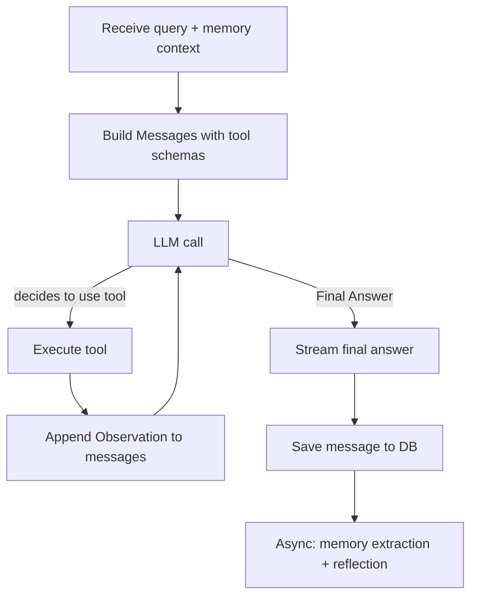

# Agentic RAG

LyraNote's conversation system has evolved from "linear RAG" to **Agentic RAG** — the AI no longer just "retrieves and answers." It reasons like a researcher: thinking, calling tools, observing results, and iterating until it finds the best answer.

## Plain RAG vs Agentic RAG

| Dimension | Plain RAG | Agentic RAG (LyraNote) |
|---|---|---|
| Execution | Single-step linear: retrieve → answer | Multi-step loop: think → tool → observe → think |
| Knowledge sources | Internal vector store only | Knowledge base + web search + note creation |
| Complex questions | One retrieval pass, quality limited | Decomposes sub-questions, multi-round aggregation |
| Active actions | Can only answer | Can create notes, update preferences, trigger tasks |
| Reasoning visibility | Black box | Every tool call visible in real time |

## The ReAct Loop

LyraNote uses the **ReAct (Reasoning + Acting)** framework — the LLM "thinks" before each step and decides whether to call a tool:



A real reasoning trace example:

```
Thought: The user wants the core contributions of this paper. 
         I should search for relevant content first.
Action: search_notebook_knowledge("core contributions innovation")
Observation: [Found 4 relevant chunks, relevance 0.82...]

Thought: I have enough information to answer directly.
Final Answer: The paper's core contribution is...
```

To prevent infinite loops, the Agent calls at most **5 tools** before forcing a final answer. In practice, 95% of questions are resolved within 2 tool calls.

## Available Tools (Skills)

Every tool the Agent can call is a pluggable Skill — dynamically loaded based on user configuration and environment variables:

| Tool | Called When | Effect |
|---|---|---|
| `search_notebook_knowledge` | Query needs knowledge base retrieval | Vector search Top-K document chunks |
| `web_search` | Knowledge base insufficient, or user requests web search | Tavily live search; results saved to knowledge base |
| `summarize_sources` | User requests summary / FAQ / study guide | Triggers Artifact generation |
| `create_note_draft` | User requests note creation | Creates a new note directly in the notebook |
| `update_user_preference` | User explicitly states a preference (e.g. "keep answers short") | Updates L2 memory, takes effect immediately |
| `create_scheduled_task` | User requests recurring task execution | Creates an automated scheduled workflow |

## Transparent Reasoning

You can see every step of the Agent's thinking in the Copilot panel:

```
┌─ Thinking... ──────────────────────────────────┐
│ 🔍 Searching knowledge base: "Transformer      │
│    attention mechanism"                         │
│ ✓ Found 4 relevant chunks (relevance 0.82)      │
│ 🌐 Insufficient internal info, searching web... │
│ ✓ Found 3 web results                           │
└────────────────────────────────────────────────┘
Based on your notebook, the core innovation of
Transformer is...
```

Every tool call is pushed to the frontend in real time via SSE — users see exactly what the AI is doing rather than waiting on a black box.

## SSE Event Stream

The Agent's execution is pushed as Server-Sent Events. The frontend handles these event types:

| Event Type | Fields | Meaning |
|---|---|---|
| `token` | `content: string` | Output token of the final answer |
| `citations` | `citations: []` | List of cited source documents |
| `tool_call` | `tool: string, input: {}` | Agent is calling a tool |
| `tool_result` | `content: string` | Tool result preview |
| `done` | — | Stream complete |

## Before vs After: Same Question, Different Systems

**Plain RAG:**
> Based on your notebook, [Source 1] mentions...
> _(Same phrasing every time, doesn't know who you are)_

**Agentic RAG (memory injection + multi-step tools + scene adaptation):**

```
[Memory injected: technical_level=expert, interest_topic=attention mechanism]
[Scene detected: research — deep exploration mode]

┌─ Thinking... ──────────────────────────────────┐
│ 🔍 Searching: "Flash Attention core innovation" │
│ ✓ Found 5 relevant chunks (relevance 0.85)      │
└────────────────────────────────────────────────┘

Flash Attention 2's core innovations are three-fold:
1. IO complexity reduced from O(N²) to O(N)...
(Response matches expert level — skips basics, goes deep)
```
