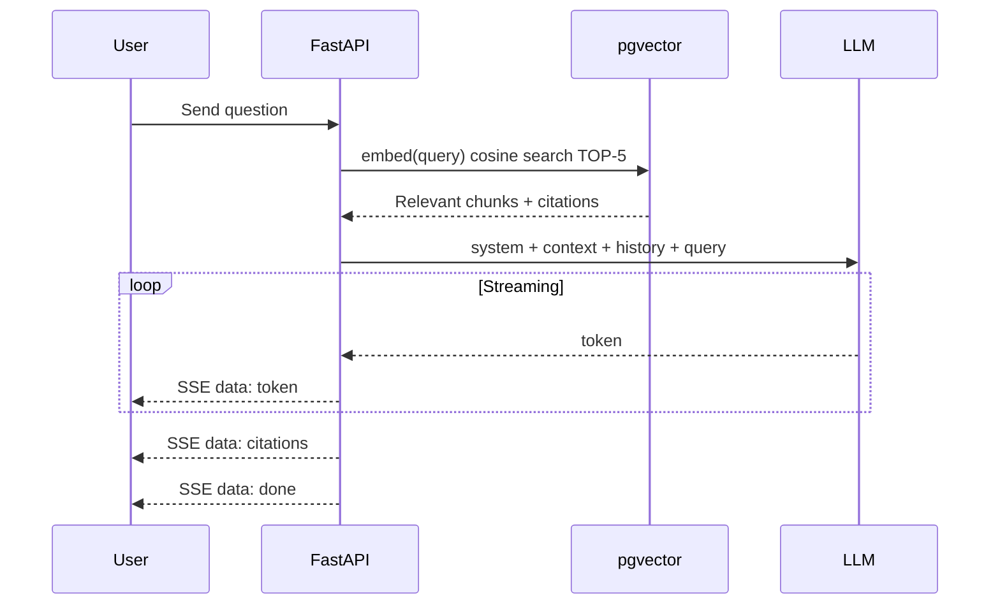

# AI Chat

LyraNote's AI Chat lets you have natural conversations with your personal knowledge base. Instead of manually searching files, just ask a question and get a precise, cited answer sourced from your own content.

## How It Works: RAG Pipeline

LyraNote uses **Retrieval-Augmented Generation (RAG)** to answer your questions:

1. Your uploaded documents and URLs are chunked (512 tokens, 64 overlap) and converted into 1536-dimensional vector embeddings stored in PostgreSQL (pgvector).
2. When you ask a question, the query is embedded and matched against your knowledge base using cosine distance — retrieving the top 5 most semantically relevant chunks.
3. Those chunks are passed to the LLM as context alongside your conversation history, producing a grounded, accurate response with source citations.

## Uploading Knowledge

Add content to your knowledge base in several ways:

- **File upload** — PDF, Markdown, plain text, Word documents
- **URL ingestion** — Paste any web page URL; LyraNote scrapes and indexes it automatically
- **Manual notes** — Write directly in the rich text editor; your notes are indexed into the knowledge base and become searchable in future conversations

## Asking Questions

Open the Chat panel and type naturally:

> "What were the key architectural decisions in my storage system design?"
> "Summarize the main findings from my uploaded research papers."
> "Compare the approaches described across all my sources."

The AI responds with an answer and inline citations linking to the source documents it used.

## Three-Layer Memory

LyraNote maintains a **three-layer memory** system that makes every conversation more personalized over time:

### Layer 1 — User Long-term Memory
After each conversation, the AI asynchronously extracts facts about you:
- Writing style preferences (e.g., "prefers concise answers")
- Research interests (e.g., "interested in machine learning")
- Technical level (e.g., "expert-level")

These are injected into the system prompt on subsequent conversations, so the AI adapts to you automatically.

### Layer 2 — Notebook Memory
Each time you index a new source, LyraNote refreshes a notebook-level summary and key themes. This gives the AI awareness of what the entire notebook is researching, making retrieval more contextually accurate.

### Layer 3 — Conversation History
The AI retains the last 20 turns of conversation history. For long conversations (40+ turns), earlier exchanges are automatically compressed into a summary to stay within context limits.

## Inline Writing Assistance

While editing notes, LyraNote's editor offers **AI ghost text** — predictive suggestions that appear inline as you type. Press `Tab` to accept a suggestion.

You can also select any text in the editor to:
- **Polish** — Improve clarity and flow
- **Shorten** — Make it more concise
- **Expand** — Add more detail

## Proactive AI Suggestions

LyraNote doesn't just wait for you to ask questions. It proactively surfaces relevant help:

- **After indexing** — When a document finishes processing, the AI suggests 2–3 questions you might want to ask about it
- **Context greeting** — When you open a notebook, the AI greets you with personalized suggestions based on the notebook's current state
- **Writing companion** — While you write, the Copilot panel surfaces related knowledge base fragments that match what you're currently writing
- **Idle nudge** — After 45 seconds without typing, the AI gently offers to help continue or search for related material

## Supported LLM Providers

Because LyraNote uses an OpenAI-compatible API, you can point it at any compatible provider:

| Provider | `OPENAI_BASE_URL` |
|---|---|
| OpenAI (default) | _(leave empty)_ |
| DeepSeek | `https://api.deepseek.com` |
| Ollama (local) | `http://localhost:11434/v1` |
