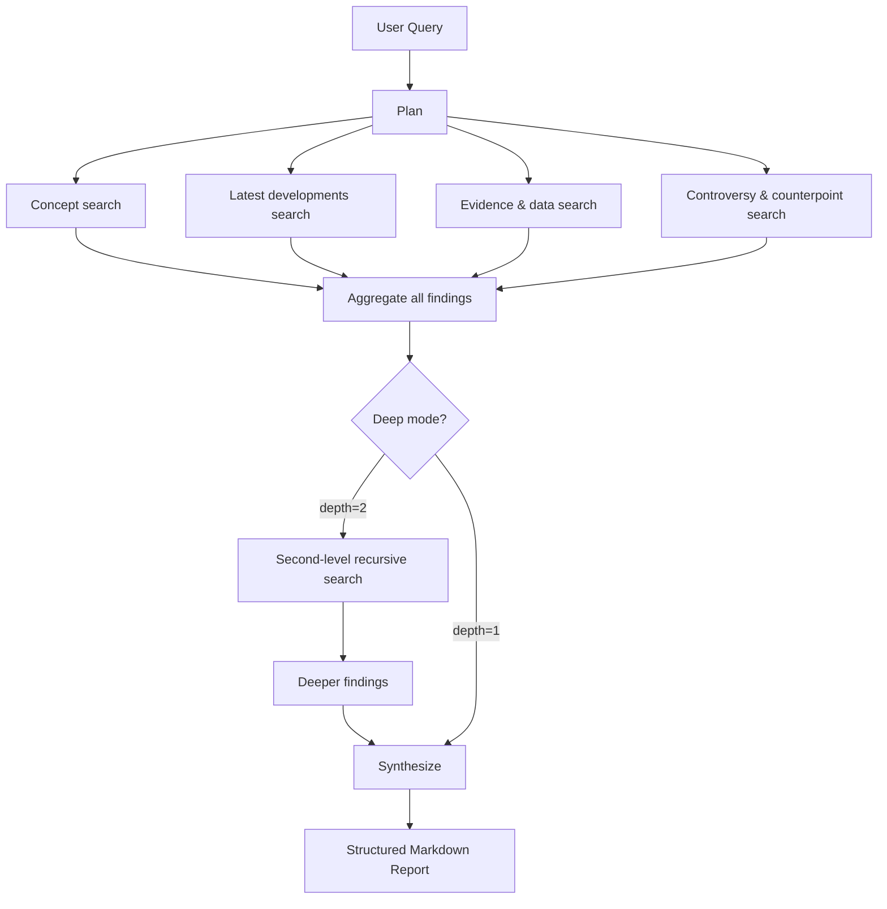

# Deep Research

Deep Research is an autonomous AI agent that conducts multi-step research on any topic and produces a comprehensive, structured report — automatically.

## How It Differs from Regular Chat

| Dimension | Regular Chat | Deep Research |
|---|---|---|
| Execution | Single round (1 LLM call + RAG) | Multi-round (plan → search × N → synthesize) |
| Speed | Seconds | 20 seconds – 5 minutes |
| Knowledge sources | Internal RAG | Internal RAG **+** live web search |
| Output | Conversational message | Structured Markdown report (Artifact) |
| Citations | RAG retrieval score | Per-finding source annotations |
| Best for | Quick questions, concept explanations | Comprehensive surveys, comparative analysis |

## The Research Pipeline

Deep Research uses a **recursive breadth-depth algorithm** inspired by the best open-source implementations:



Each finding is graded by evidence strength:
- **Strong** — Multiple sources with cross-validation between internal and web
- **Medium** — At least 2 sources, or 1 authoritative internal source
- **Weak** — Single source or blog-type content only

## Two Research Modes

| Mode | Depth | Max Searches | Expected Time |
|---|---|---|---|
| Quick | 1 level | 3–6 | 20–60 seconds |
| Deep | 2 levels | 9–12 | 2–5 minutes |

The second level digs deeper: new search queries are dynamically generated from the findings of the first level, progressively narrowing and specializing the research.

## The Research Report

Reports are saved as **Artifacts** and include:

- An **executive summary**
- Sections organized by sub-topic, with dimension badges (Concept / Latest / Evidence / Controversy)
- **Inline citations** linking to source URLs
- A **controversies and counterpoints** section
- A **conclusions and action items** section
- A **references list** at the bottom

Each finding card shows an evidence strength indicator (green/yellow/red dot) so you can quickly assess reliability.

## Starting a Research Task

1. Open the **Chat** panel in any notebook.
2. Click the **🔬 Deep Research** mode toggle next to the input box.
3. Type your research question, e.g.:
   > "What are the latest architectural patterns for long-term memory in LLM agents?"
4. Click **Start Research**. The agent runs in the background.
5. Progress is shown in real time — you can see each sub-question being researched and findings as they come in.

## Requirements

Deep Research requires a **Tavily API key** for web search. Configure it in `api/.env`:

```bash
TAVILY_API_KEY=tvly-...
```

Without Tavily, Deep Research still works but uses only your internal knowledge base — no live web results.

## Follow-up and Feedback

After the report is generated, you can:

- **Ask follow-up questions** — Suggested next questions appear at the bottom of the report card
- **Rate the report** — Thumbs up/down feedback
- **Save as note** — One-click to save the full Markdown report to your notebook
- **Save web sources** — Optionally add all web pages found during research to your knowledge base for future retrieval
