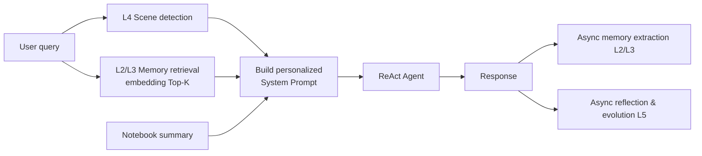
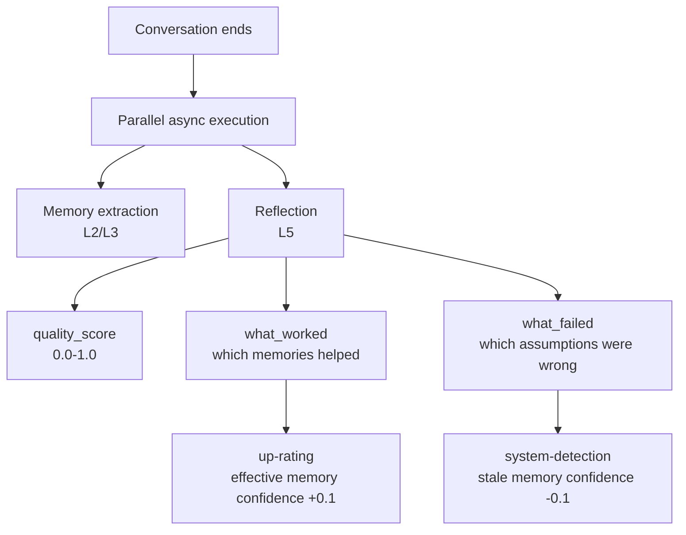

# Memory System

LyraNote's memory system makes the AI understand you better over time. It's not just preference storage — it's a **five-layer memory architecture** that evolves from tool execution all the way to self-reflection.

## From Plain RAG to Memory-Aware AI

A plain RAG system starts from scratch every conversation:

```
User query → Retrieve documents → LLM answers (doesn't know who you are)
```

LyraNote's memory system adds a **persistent user cognition layer** on top:



## Five-Layer Memory Architecture

Inspired by AI-Infra's five-layer architecture, LyraNote organizes memory into five levels:

| Layer | Name | Content | Status |
|---|---|---|---|
| L1 | Tool layer | search / write / web_search agent tools | Existing |
| L2 | Preference memory | Writing style, technical level, language preference (with decay) | Implemented |
| L3 | Fact / skill memory | Current research topic, known misconceptions (with TTL) | Implemented |
| L4 | Scene awareness | Intent detection: research / writing / learning / review | Implemented |
| L5 | Reflective evolution | AI evaluates its own performance, reinforces effective memory | Implemented |

## L2 — Preference Memory

After each conversation, the AI asynchronously extracts your **stable preferences**:

```json
{
  "preferences": [
    { "key": "writing_style", "value": "Concise and direct, prefers bullet points", "confidence": 0.85 },
    { "key": "technical_level", "value": "Expert-level, familiar with LLM internals", "confidence": 0.9 },
    { "key": "output_preference", "value": "Show code examples first, then explanation", "confidence": 0.75 }
  ]
}
```

**Decay mechanism**: Preferences not accessed for 60+ days with fewer than 3 uses lose 0.1 confidence daily. Below 0.2, they are deleted automatically — preventing stale preferences from interfering with answers.

**Conflict protection**: A newly extracted memory must exceed the existing confidence by 0.15 to overwrite it — preventing a single unusual conversation from corrupting a long-established preference profile.

## L3 — Fact / Skill Memory

Beyond preferences, the AI also extracts **context-specific facts** with expiration times (TTL):

```json
{
  "facts": [
    { "key": "current_research_topic", "value": "Memory mechanisms in RAG systems", "confidence": 0.9, "ttl_days": 30 },
    { "key": "known_misconception", "value": "User believes vector search can fully replace keyword search", "confidence": 0.6, "ttl_days": 14 }
  ]
}
```

| Memory Type | TTL | Typical Content |
|---|---|---|
| `preference` | None (decay-controlled) | Writing style, technical level |
| `fact` | 30 days | Current research topic, today's discussion |
| `skill` | 90 days | User's known / unknown knowledge areas |

## L4 — Scene Awareness

On the first message of each conversation, the system runs a lightweight intent classifier (< 50 tokens, imperceptible latency) that adapts the AI's response strategy:

| Scene | Triggered When | AI Response Strategy |
|---|---|---|
| `research` | Open-ended complex questions, exploring new territory | Multi-angle structured analysis, suggest follow-up questions |
| `writing` | Requesting continuation, polish, or writing advice | Match user's voice and tone, avoid over-explaining |
| `learning` | Requesting explanation or examples | Use analogies and examples, build understanding progressively |
| `review` | Looking up known information | Precise and brief, get straight to the point |

## L5 — Reflective Evolution

After each conversation, the AI performs an **asynchronous self-evaluation**:



Example reflection:

> **quality_score**: 0.82  
> **what_worked**: Correctly identified user's expert background, used appropriate technical terminology, skipped basic concept explanations  
> **what_failed**: Didn't realize user already knew RAG basics — over-explained fundamentals  
> **memory_reinforced**: `technical_level`, `domain_expertise`

This creates a **positive feedback loop**: effective memories get reinforced → more accurate answers → higher quality scores → more reinforcement.

## Context-Aware Injection

Memory injection isn't "dump all memories into the prompt" — it's **relevance-filtered**:

1. Embed all memories with confidence ≥ 0.3
2. Compute cosine similarity against the current query
3. Inject only the Top-5 most relevant memories into the System Prompt
4. Update access count and timestamp for used memories

Even with dozens of stored memories, only the truly relevant ones are injected — preserving context window budget.

## Viewing and Managing Your Memory

Go to **Settings → Memory** to see what the AI knows about you:

- View all preference, fact, and skill memories with their confidence scores
- Manually correct any inaccurate memory value
- Delete memories you don't want the AI to retain
- Browse AI reflection history (quality scores and improvement notes per conversation)
- Reset all memories with one click
