# Scheduled Tasks

LyraNote can create automated, recurring tasks that run on a schedule — turning the AI from a passive tool into an active assistant that works for you continuously.

## What Are Scheduled Tasks?

Scheduled tasks let the AI Agent monitor topics, generate content, and deliver results to you automatically. You create them by simply asking in chat:

> "Help me monitor AI news daily and send a summary to my email."
> "Every Monday, summarize what's new in my knowledge base."
> "Every 3 days, check on competitor updates and write a brief report."

The AI understands your intent, creates the task, and it runs automatically from then on — no further action needed.

## Supported Task Types

| Type | Description |
|---|---|
| **News Digest** | Searches the web for your topics, generates a structured article, delivers via email or note |
| **Knowledge Briefing** | Summarizes new content added to your knowledge base since the last briefing |
| **Research Update** | Periodic deep research tracking on a topic (tracks how it evolves over time) |

## How It Works

```mermaid
flowchart LR
    U["You (in chat)"] --> AI[AI Agent detects intent]
    AI --> SK[Calls create_scheduled_task skill]
    SK --> DB[(Scheduled Tasks DB)]

    DB --> Beat[Celery Beat\nevery minute]
    Beat -->|due task| Exec[execute_scheduled_task]

    Exec --> T1[Phase 1\nTavily web search]
    T1 --> T2[Phase 2\nLLM generates article]
    T2 --> T3[Phase 3\nEmail / Note delivery]
    T3 --> T4[Phase 4\nUpdate run status]
```



## Creating a Task via Chat

Simply describe what you want in the Chat panel. The AI will ask for any missing details and confirm before creating:

```
You: Help me monitor the latest developments in quantum computing, 
     send a weekly summary to my email.

AI: ✅ Scheduled task created!

    Task name: Quantum Computing Weekly
    Topic: quantum computing, breakthroughs, 2025
    Schedule: Every Monday at 9:00 AM
    Delivery: Email → you@example.com
    First run: 2026-03-17 09:00 (UTC)

    You can manage this task in Settings → Scheduled Tasks.
```

## Delivery Options

| Method | Description |
|---|---|
| `email` | Generates HTML email from Markdown and sends via SMTP |
| `note` | Creates a new note in your notebook |
| `both` | Sends email and creates note simultaneously |

## Schedule Frequencies

| Frequency | Schedule |
|---|---|
| Daily | Every day at 8:00 AM |
| Weekly | Every Monday at 9:00 AM |
| Every 3 days | Every 3 days at 8:00 AM |
| Bi-weekly | 1st and 15th of each month |
| Monthly | 1st of each month |

You can also use custom cron expressions for precise control.

## Managing Tasks

Navigate to **Settings → Scheduled Tasks** to view all your tasks. From there you can:

- **Enable / disable** a task with a toggle
- **Edit** the topic, schedule, or delivery settings
- **Run now** — manually trigger an immediate execution
- **View history** — see every past run with its generated content, source count, duration, and delivery status
- **Delete** a task

## Article Quality

Generated articles follow a consistent structure:

1. **Executive summary** — 2–3 sentence overview
2. **Grouped sections** — related findings organized by sub-topic
3. **Source citations** — links to all web pages used
4. **Generation date** — clearly marked at the top

You can customize the article style:
- **Summary** — Concise digest, 2–3 sentences per item
- **Detailed** — In-depth analysis of each finding
- **Briefing** — Bullet-point format for quick scanning

## Reliability

LyraNote includes several safeguards for scheduled tasks:

- **Retry on failure** — Tasks retry up to 2 times (5-minute delay between retries)
- **Auto-disable** — Tasks that fail 5 consecutive times are automatically disabled with an error note
- **Duplicate prevention** — Celery Beat updates the next run time before dispatching, preventing double-execution
- **Per-user limit** — Maximum 10 active tasks per user

## Email Configuration

To use email delivery, configure SMTP in `api/.env`:

```bash
SMTP_HOST=smtp.gmail.com
SMTP_PORT=587
SMTP_USER=your@gmail.com
SMTP_PASSWORD=your-app-password
EMAIL_FROM=your@gmail.com
```

For Gmail, generate an [App Password](https://support.google.com/accounts/answer/185833) rather than using your account password directly.
