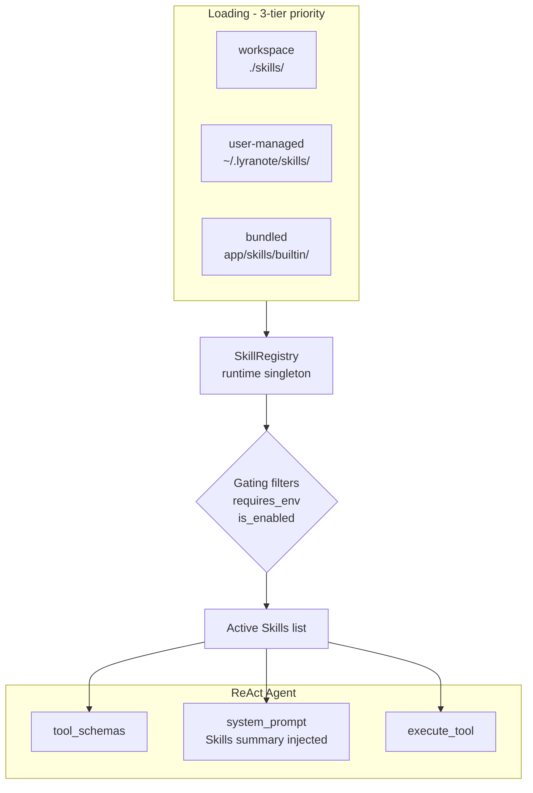

# Skills System

LyraNote's AI Agent is built on a **pluggable Skills system** — every tool the agent can use is implemented as a standalone Skill that can be enabled, disabled, or configured independently.

## Why a Skills System?

Without this architecture, agent tools are hardcoded in a single file:

```python
TOOL_SCHEMAS: list[dict] = [...]   # 6 fixed tool schemas
_EXECUTORS: dict = {...}           # 6 fixed executor functions
```

This makes it impossible to:
- Enable/disable tools per user without code changes
- Let users configure tool parameters (e.g., max search results)
- Add new tools without modifying core agent code
- Support community-contributed extensions in the future

The Skills system solves all of this.

## Architecture



**Loading priority** (higher overrides lower):
1. Workspace skills — `./skills/*.py`
2. User-managed skills — `~/.lyranote/skills/*.py`
3. Built-in skills — `app/skills/builtin/`

## Built-in Skills

| Skill | Category | Required Env | Always On | Configurable |
|---|---|---|---|---|
| `search-notebook-knowledge` | knowledge | — | Yes | `top_k`, `min_score` |
| `web-search` | web | `TAVILY_API_KEY` | No | `max_results`, `search_depth` |
| `summarize-sources` | knowledge | — | No | `max_chunks` |
| `create-note-draft` | writing | — | No | — |
| `update-user-preference` | memory | — | Yes | — |
| `generate-mind-map` | knowledge | — | No | `default_depth` |
| `scheduled-task` | productivity | — | No | — |

**Always On** skills cannot be disabled — they are core capabilities (knowledge retrieval and memory).

**Gating**: Skills with `required_env` are automatically excluded if the environment variable is not set. For example, if `TAVILY_API_KEY` is not configured, the `web-search` skill silently drops out and the agent never tries to call it.

## Managing Skills

Navigate to **Settings → Skills** to see all available skills with their current status.

From this page you can:
- **Enable / disable** any non-core skill
- **Configure** skill parameters (e.g., set `web-search` max results to 10)
- See which skills are active for the current session and whether all required environment variables are satisfied

## How the Agent Uses Skills

When you send a message to the AI Chat, the agent:

1. Loads your active skills for this session
2. Builds a list of OpenAI function-calling schemas from those skills
3. Injects a skills summary into the system prompt
4. Calls the LLM with the tool schemas — the LLM decides which tool to use
5. Executes the chosen tool and feeds the result back into the loop

The agent runs in a **ReAct loop** (Reasoning + Acting): it can call multiple tools in sequence before producing a final answer, with each tool result informing the next decision.

## Writing a Custom Skill

Each skill is a Python class inheriting from `SkillBase`. Adding a new skill requires only one file (~50–80 lines):

```python
# skills/my_skill.py
from app.skills.base import SkillBase, SkillMeta

class MySkill(SkillBase):
    meta = SkillMeta(
        name="my-skill",
        display_name="My Custom Skill",
        description="Does something useful when the user asks about X.",
        category="knowledge",
        thought_label="⚙️ Running My Skill",
    )

    def get_schema(self, config=None) -> dict:
        return {
            "name": "my_skill",
            "description": self.meta.description,
            "parameters": {
                "type": "object",
                "properties": {
                    "query": {"type": "string", "description": "Input query"},
                },
                "required": ["query"],
            },
        }

    async def execute(self, args: dict, ctx) -> str:
        query = args["query"]
        # ... your logic here ...
        return f"Result for: {query}"

skill = MySkill()  # module-level instance required for auto-discovery
```

Place this file in `./skills/` (workspace) or `~/.lyranote/skills/` (user-managed), and it will be automatically discovered and loaded on the next request — no restart needed in development mode.
