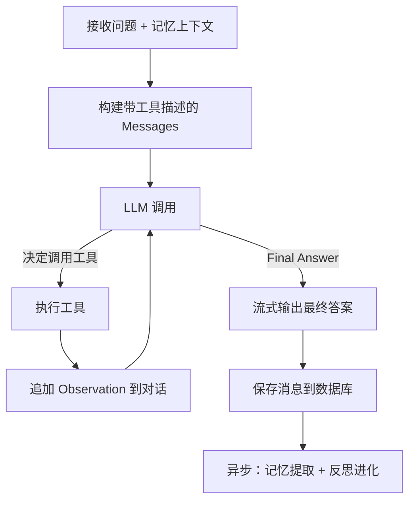

# Agentic RAG

LyraNote 的对话系统已从"线性 RAG"升级为 **Agentic RAG** —— AI 不再只是"检索 + 回答"，而是像真正的研究员一样，能主动思考、调用工具、多步推理，直到找到最佳答案。

## 普通 RAG vs Agentic RAG

| 维度 | 普通 RAG | Agentic RAG（LyraNote） |
|---|---|---|
| 执行模式 | 单步线性：检索 → 回答 | 多步循环：思考 → 工具 → 观察 → 思考 |
| 知识来源 | 只有内部向量库 | 内部知识库 + 网络搜索 + 笔记创建 |
| 对复杂问题 | 一次检索，质量受限 | 可拆解子问题，多轮检索聚合 |
| 主动行动 | 只能回答 | 可创建笔记、更新偏好、触发任务 |
| 推理透明度 | 黑盒 | 每步工具调用实时可见 |

## ReAct 循环

LyraNote 使用 **ReAct（Reasoning + Acting）** 框架让 LLM 在回答前先"思考"并决定是否调用工具：



一个真实的推理过程示例：

```
Thought: 用户想了解这篇论文的核心贡献，我需要先检索相关内容
Action: search_notebook_knowledge("核心贡献 创新点")
Observation: [找到 4 条相关块，相关度 0.82...]

Thought: 找到了足够信息，可以直接回答了
Final Answer: 这篇论文的核心贡献是...
```

为防止无限循环，Agent 最多执行 **5 次工具调用**后强制给出答案。实测 95% 的问题在 2 轮以内解决。

## 可用工具（Skills）

Agent 能调用的每个工具都是一个可插拔的 Skill，根据用户配置和环境变量动态加载：

| 工具 | 调用场景 | 效果 |
|---|---|---|
| `search_notebook_knowledge` | 用户提问需要检索知识库 | 向量检索 Top-K 相关文档块 |
| `web_search` | 知识库信息不足，或用户要求搜索网络 | Tavily 实时搜索，结果保存到知识库 |
| `summarize_sources` | 用户要求生成摘要/FAQ/学习指南 | 触发 Artifact 生成 |
| `create_note_draft` | 用户要求创建笔记 | 直接在笔记本中新建笔记 |
| `update_user_preference` | 用户明确表达偏好（如"以后回答要简短"） | 更新 L2 记忆，立即生效 |
| `create_scheduled_task` | 用户要求定期执行某任务 | 创建自动化定时工作流 |

## 思考过程可视化

对话时可以在 Copilot 面板中看到 Agent 的每一步：

```
┌─ 正在思考... ─────────────────────────────┐
│ 🔍 搜索知识库："Transformer 注意力机制"     │
│ ✓ 找到 4 条相关内容（相关度 0.82）          │
│ 🌐 知识库信息不足，正在搜索网络...          │
│ ✓ 找到 3 条网页结果                        │
└────────────────────────────────────────────┘
根据你的笔记本资料，Transformer 的核心创新是...
```

每条工具调用都实时推送到前端（通过 SSE），让用户清楚地看到 AI "在做什么"而不是等待黑盒输出。

## SSE 事件流

Agent 执行过程通过 Server-Sent Events 实时推送，前端可处理以下事件类型：

| 事件类型 | 字段 | 含义 |
|---|---|---|
| `token` | `content: string` | 最终答案的输出 token |
| `citations` | `citations: []` | 引用的来源文档列表 |
| `tool_call` | `tool: string, input: {}` | 正在调用某个工具 |
| `tool_result` | `content: string` | 工具返回结果预览 |
| `done` | — | 流式输出结束 |

## 与普通 RAG 对比示例

**同一问题，两种系统的回答差异：**

**普通 RAG：**
> 根据你的笔记本资料，[来源1] 中提到...
> （每次回答方式相同，不知道你是谁）

**Agentic RAG（记忆注入 + 多步工具 + 场景适配）：**

```
[记忆注入：technical_level=专家级，interest_topic=注意力机制]
[场景识别：research 深度研究模式]

┌─ 正在思考... ──────────────────────────────┐
│ 🔍 搜索："Flash Attention 核心创新"          │
│ ✓ 找到 5 条相关内容（相关度 0.85）           │
└────────────────────────────────────────────┘

Flash Attention 2 的核心创新有三点：
1. IO 复杂度从 O(N²) 降至 O(N)...
（回答风格匹配专家水平，直接深入，不解释基础概念）
```
