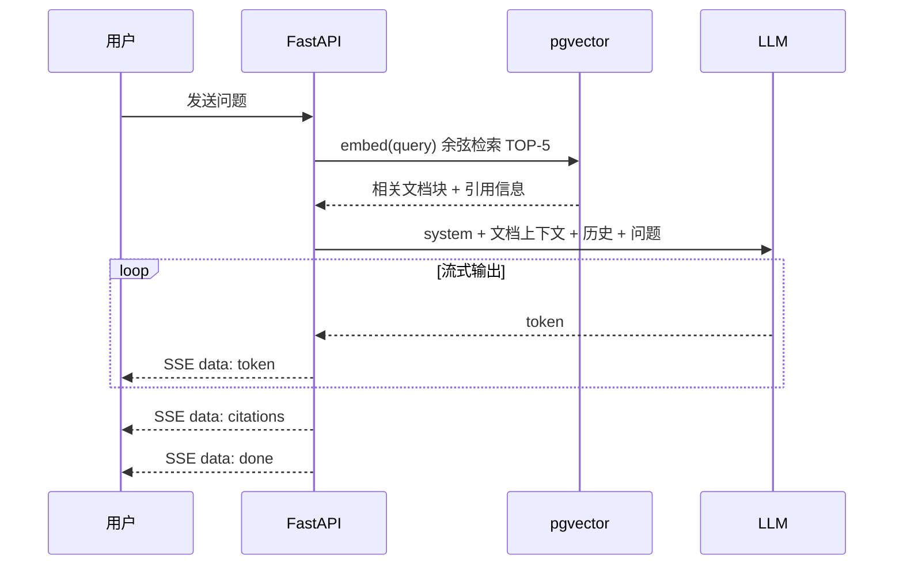

# AI 对话

LyraNote 的 AI 对话功能让你能够与个人知识库进行自然语言交流。无需手动搜索文件，直接提问即可获得精准、有来源引用的答案。

## 工作原理：RAG 流水线

LyraNote 使用 **RAG（检索增强生成）** 技术回答问题：

1. 上传的文档和 URL 被分块（512 token，64 token 重叠）并转化为 1536 维向量嵌入，存储在 PostgreSQL（pgvector）中。
2. 提问时，问题被嵌入并使用余弦距离匹配知识库，检索语义最相关的 5 个内容块。
3. 这些内容块连同对话历史一起传递给 LLM，生成有根据的答案并附带来源引用。

## 上传知识

向知识库添加内容的几种方式：

- **文件上传** — PDF、Markdown、纯文本、Word 文档
- **URL 导入** — 粘贴任意网页 URL，LyraNote 自动抓取并建立索引
- **手动笔记** — 直接在富文本编辑器中编写，你的笔记会被自动索引到知识库，在后续对话中可被检索

## 提问

打开对话面板，用自然语言输入问题：

> "我关于存储架构的核心决策是什么？"
> "总结我上传的所有研究论文的主要发现。"
> "对比我所有来源中描述的不同方法。"

AI 会给出回答并附上内联引用，链接到所使用的来源文档。

## 三层记忆系统

LyraNote 维护一套**三层记忆**系统，让每次对话都随时间变得更加个性化：

### 第一层 — 用户长期记忆
每次对话结束后，AI 会异步提取关于你的信息：
- 写作风格偏好（如"偏好简洁的回答"）
- 研究兴趣领域（如"关注机器学习"）
- 技术水平（如"专家级"）

这些信息在后续对话中注入系统提示，使 AI 自动适应你的习惯。

### 第二层 — 笔记本记忆
每次索引新来源时，LyraNote 刷新笔记本级别的摘要和核心主题，让 AI 了解整个笔记本在研究什么，从而使检索更具上下文意识。

### 第三层 — 对话历史
AI 保留最近 20 轮对话历史。对于超过 40 轮的长对话，早期内容会自动压缩为摘要，以保持在上下文窗口限制内。

## 内联写作辅助

在编辑笔记时，LyraNote 的编辑器提供 **AI 幽灵文本** 功能——在你输入时自动显示内联预测建议。按 `Tab` 接受建议。

你也可以选中任意文本：
- **润色** — 提升表达的清晰度和流畅性
- **精简** — 让内容更简洁
- **扩写** — 添加更多细节

## AI 主动感知

LyraNote 不只是等你提问，它会主动在合适的时机提供帮助：

- **索引完成后** — 文档处理完成时，AI 自动推荐 2–3 个你可能想问的问题
- **上下文问候** — 打开笔记本时，AI 根据笔记本的当前状态给出个性化建议
- **写作伴侣** — 编写笔记时，Copilot 面板自动浮现与你正在写的内容相关的知识库片段
- **空闲提示** — 停止输入 45 秒后，AI 会轻柔地提示你是否需要帮助继续写作或搜索相关资料

## 支持的 LLM 提供商

LyraNote 使用 OpenAI 兼容接口，可以接入任何兼容的提供商：

| 提供商 | `OPENAI_BASE_URL` |
|---|---|
| OpenAI（默认） | _（留空）_ |
| DeepSeek | `https://api.deepseek.com` |
| Ollama（本地） | `http://localhost:11434/v1` |
