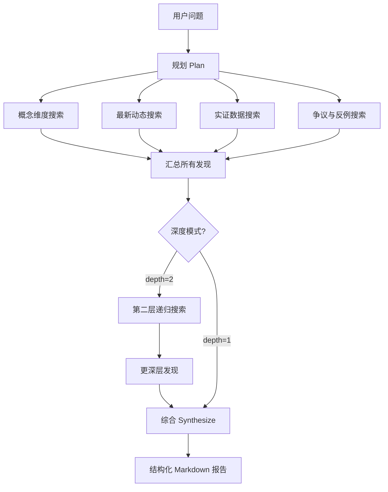

# 深度研究

深度研究是一个自主 AI Agent，能够对任何主题进行多步骤研究，并自动生成全面、结构化的研究报告。

## 与普通对话的区别

| 维度 | 普通对话 | 深度研究 |
|---|---|---|
| 执行轮次 | 单轮（1 次 LLM 调用 + RAG） | 多轮（规划 → 搜索 × N → 综合） |
| 执行时间 | 秒级 | 20 秒 – 5 分钟 |
| 知识来源 | 内部 RAG | 内部 RAG **+** 实时网络搜索 |
| 输出形式 | 对话消息 | 结构化 Markdown 报告（Artifact） |
| 引用质量 | RAG 检索分数 | 按信息点逐一标注来源 |
| 适用场景 | 快速提问、解释概念 | 综述调研、对比分析、系统性梳理 |

## 研究流水线

深度研究使用**递归广度-深度算法**，参考了业界最优秀的开源实现：



每条发现按证据强度评级：
- **强** — 多个来源，内部与网络交叉印证
- **中** — 至少 2 个来源，或 1 个权威内部来源
- **弱** — 单一来源或仅博客类内容

## 两种研究模式

| 模式 | 深度 | 最大搜索次数 | 预期耗时 |
|---|---|---|---|
| 快速模式 | 1 层 | 3–6 次 | 20–60 秒 |
| 深度模式 | 2 层 | 9–12 次 | 2–5 分钟 |

第二层会深入挖掘：新搜索词从第一层的发现中动态生成，研究越来越聚焦和专业化。

## 研究报告

报告以 **Artifact** 形式保存，包含：

- **执行摘要** — 2–3 句话概述
- **按子主题分组的章节**，每条发现带有维度标签（概念 / 最新动态 / 实证数据 / 争议）
- **内联引用**，链接到来源 URL
- **争议与反例**章节
- **结论与行动清单**章节
- 底部的**参考文献列表**

每条发现卡片显示证据强度指示器（绿色/黄色/红色色点），方便快速评估可靠性。

## 启动研究任务

1. 在任意笔记本中打开**对话**面板。
2. 点击输入框旁的 **🔬 深度研究**模式切换按钮。
3. 输入你的研究问题，例如：
   > "LLM Agent 长期记忆的最新架构模式有哪些？"
4. 点击**开始研究**。Agent 在后台运行。
5. 进度实时显示 — 你可以看到每个子问题的研究过程和发现。

## 配置要求

深度研究需要 **Tavily API 密钥**才能进行网络搜索。在 `api/.env` 中配置：

```bash
TAVILY_API_KEY=tvly-...
```

没有 Tavily 时，深度研究仍可工作，但只使用内部知识库，不进行实时网络搜索。

## 后续操作与反馈

报告生成后，你可以：

- **追问** — 报告卡片底部会显示建议的后续问题
- **评分** — 点赞/点踩反馈
- **保存为笔记** — 一键将完整 Markdown 报告保存到笔记本
- **保存网络来源** — 可选将研究过程中找到的所有网页添加到知识库，以便后续检索
