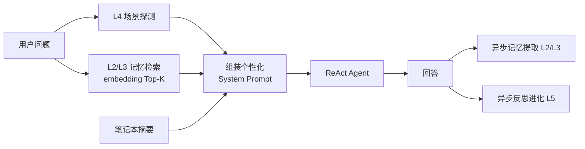
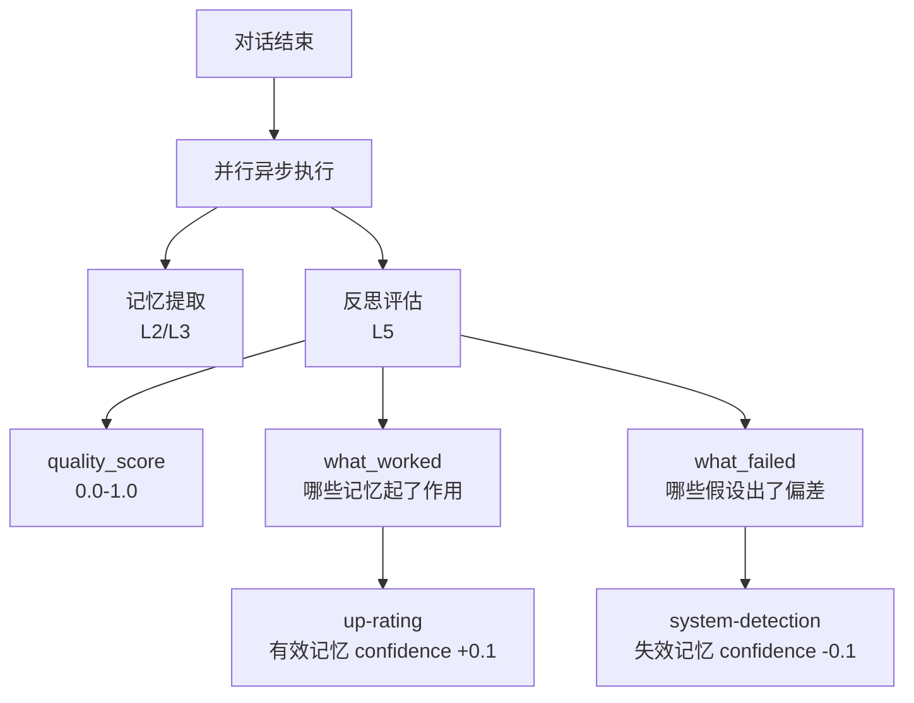

# 记忆系统

LyraNote 的记忆系统让 AI 随着使用时间越来越懂你。它不只是记住偏好，而是构建了一套**五层记忆体系**，从工具调用到自我反思，全面进化。

## 从普通 RAG 到有记忆的 AI

普通 RAG 系统每次对话都从零开始：

```
用户问题 → 检索文档 → LLM 回答（不记得你是谁）
```

LyraNote 的记忆系统在此基础上增加了**持久的用户认知层**：



## 五层记忆架构

受 AI-Infra 五层架构启发，LyraNote 将记忆分为五层：

| 层级 | 名称 | 内容 | 状态 |
|---|---|---|---|
| L1 | 工具层 | search / write / web_search 等 Agent 工具 | 已有 |
| L2 | 偏好记忆 | 写作风格、技术水平、语言偏好（带衰减） | 已实现 |
| L3 | 事实/技能记忆 | 正在研究的课题、已知错误认知（带 TTL） | 已实现 |
| L4 | 场景感知 | 识别当前意图：研究 / 写作 / 学习 / 查阅 | 已实现 |
| L5 | 反思进化 | AI 评估自身表现，强化有效记忆，衰减失效记忆 | 已实现 |

## L2 — 偏好记忆

每次对话结束后，AI 异步提取关于你的**稳定偏好**：

```json
{
  "preferences": [
    { "key": "writing_style", "value": "简洁直接，偏好 bullet points", "confidence": 0.85 },
    { "key": "technical_level", "value": "专家级，熟悉 LLM 底层原理", "confidence": 0.9 },
    { "key": "output_preference", "value": "优先给代码示例，然后再解释", "confidence": 0.75 }
  ]
}
```

**衰减机制**：超过 60 天未被访问且使用次数 < 3 次的偏好记忆，每日 confidence 下降 0.1。降至 0.2 以下自动删除，防止过期偏好干扰回答。

**冲突保护**：新提取的记忆置信度必须超过旧值 0.15 才能覆盖，避免一次异常对话破坏长期建立的偏好画像。

## L3 — 事实/技能记忆

除偏好外，AI 还提取**当前状态相关的事实**，附带过期时间（TTL）：

```json
{
  "facts": [
    { "key": "current_research_topic", "value": "RAG 系统中的记忆机制设计", "confidence": 0.9, "ttl_days": 30 },
    { "key": "known_misconception", "value": "用户认为向量检索可以完全替代关键词检索", "confidence": 0.6, "ttl_days": 14 }
  ]
}
```

| 记忆类型 | TTL | 典型内容 |
|---|---|---|
| `preference` | 无（衰减机制控制） | 写作风格、技术水平 |
| `fact` | 30 天 | 当前研究课题、今天讨论的问题 |
| `skill` | 90 天 | 用户已掌握 / 欠缺的知识领域 |

## L4 — 场景感知

每次对话的第一条消息进入时，系统用轻量分类（< 50 tokens，不感知延迟）识别当前场景，并为 AI 适配不同的回答策略：

| 场景 | 识别条件 | AI 回答策略 |
|---|---|---|
| `research` 深度研究 | 开放性复杂问题，探索新领域 | 多角度结构化分析，提出延伸问题 |
| `writing` 写作辅助 | 请求续写、润色或建议 | 保持用户语气，避免过度解释 |
| `learning` 学习理解 | 请求解释或举例 | 用类比和例子，循序渐进 |
| `review` 快速查阅 | 寻找已知信息 | 精确简短，直接命中要点 |

## L5 — 反思进化

对话结束后，AI 对自身表现进行**异步自我评估**：



反思结果示例：

> **quality_score**: 0.82  
> **what_worked**: 准确识别用户的技术背景，使用了合适的专业术语，避免了基础概念解释  
> **what_failed**: 没有意识到用户已经了解 RAG 基础，过多解释了基本概念  
> **memory_reinforced**: `technical_level`, `domain_expertise`

这让记忆系统形成**正向反馈循环**：有效的记忆被强化 → 更准确的回答 → 更高的 quality_score → 更多强化。

## 上下文感知注入

记忆注入不是"把所有记忆全塞进 Prompt"，而是**按相关性筛选**：

1. 对所有 confidence ≥ 0.3 的记忆做 embedding
2. 与当前 query 计算余弦相似度
3. 取 Top-5 最相关的记忆注入 System Prompt
4. 更新被使用记忆的访问计数和时间戳

这确保了即使有几十条记忆，每次也只注入真正有帮助的那几条，不浪费 context window。

## 查看和管理你的记忆

进入**设置 → 记忆**可以查看 AI 对你的了解：

- 查看所有偏好、事实、技能记忆及其置信度
- 手动修正错误的记忆值
- 删除不希望 AI 记住的内容
- 查看 AI 反思历史（每次对话的 quality_score 和改进点）
- 一键重置所有记忆（完全清空）
