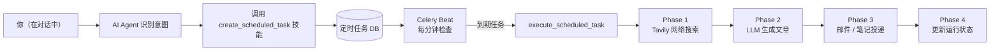

# 定时任务

LyraNote 可以创建自动化的周期性任务，让 AI 从被动工具变成主动为你持续工作的助手。

## 什么是定时任务？

定时任务让 AI Agent 能够按计划监控主题、生成内容并自动投递结果。你只需在对话中告诉 AI 你的需求，它就会创建任务并从此自动运行：

> "帮我每天监控 AI 资讯，整理成文章发到我邮箱。"
> "每周一帮我总结知识库的变化。"
> "每 3 天检查一下竞品动态，写个简报。"

AI 理解你的意图，创建任务，之后无需任何额外操作，任务按计划自动执行。

## 支持的任务类型

| 类型 | 描述 |
|---|---|
| **新闻摘要** | 搜索网络中你关注的主题，生成结构化文章，通过邮件或笔记投递 |
| **知识简报** | 汇总自上次简报以来新增到知识库的内容 |
| **研究更新** | 对某个主题进行周期性深度追踪（记录主题随时间的演变） |

## 工作流程



## 通过对话创建任务

直接在对话面板中描述你的需求。AI 会确认缺失的细节并在创建前进行确认：

```
你：帮我每周监控量子计算领域的最新进展，发到我邮箱。

AI：✅ 定时任务已创建！

    任务名称：量子计算周报
    监控主题：量子计算 最新进展 2025
    执行频率：每周一早上 9:00
    投递方式：邮件 → you@example.com
    首次执行：2026-03-17 09:00 (UTC)

    你可以在设置 → 定时任务中管理此任务。
```

## 投递方式

| 方式 | 描述 |
|---|---|
| `email` | 将 Markdown 转为 HTML 邮件，通过 SMTP 发送 |
| `note` | 在你的笔记本中创建新笔记 |
| `both` | 同时发送邮件并创建笔记 |

## 执行频率

| 频率 | 说明 |
|---|---|
| 每日 | 每天早上 8:00 |
| 每周 | 每周一早上 9:00 |
| 每 3 天 | 每 3 天早上 8:00 |
| 每两周 | 每月 1 号和 15 号 |
| 每月 | 每月 1 号 |

也可以使用自定义 Cron 表达式进行精确控制。

## 管理任务

进入**设置 → 定时任务**查看所有任务。在这里你可以：

- **启用 / 禁用** 任务（开关切换）
- **编辑** 主题、执行计划或投递设置
- **立即执行** — 手动触发一次立即执行
- **查看历史** — 查看每次执行记录，包括生成内容、来源数量、耗时和投递状态
- **删除** 任务

## 生成文章质量

生成的文章遵循统一结构：

1. **执行摘要** — 2–3 句话概览
2. **分组章节** — 按子主题组织的相关发现
3. **来源引用** — 所有使用的网页链接
4. **生成日期** — 在顶部清晰标注

可自定义文章风格：
- **摘要** — 精简摘要，每条资讯 2–3 句话
- **详细分析** — 对每条发现进行深入分析
- **简报** — 要点列表格式，适合快速浏览

## 可靠性保障

LyraNote 为定时任务内置了多项保障机制：

- **失败重试** — 任务最多重试 2 次（间隔 5 分钟）
- **自动熔断** — 连续失败 5 次的任务自动禁用并记录错误原因
- **防重复执行** — Celery Beat 在分发前先更新下次执行时间，避免重复触发
- **用户限额** — 每个用户最多 10 个活跃任务

## 邮件配置

使用邮件投递功能需要在 `api/.env` 中配置 SMTP：

```bash
SMTP_HOST=smtp.gmail.com
SMTP_PORT=587
SMTP_USER=your@gmail.com
SMTP_PASSWORD=your-app-password
EMAIL_FROM=your@gmail.com
```

使用 Gmail 时，建议生成[应用专用密码](https://support.google.com/accounts/answer/185833)，而不是直接使用账户密码。
