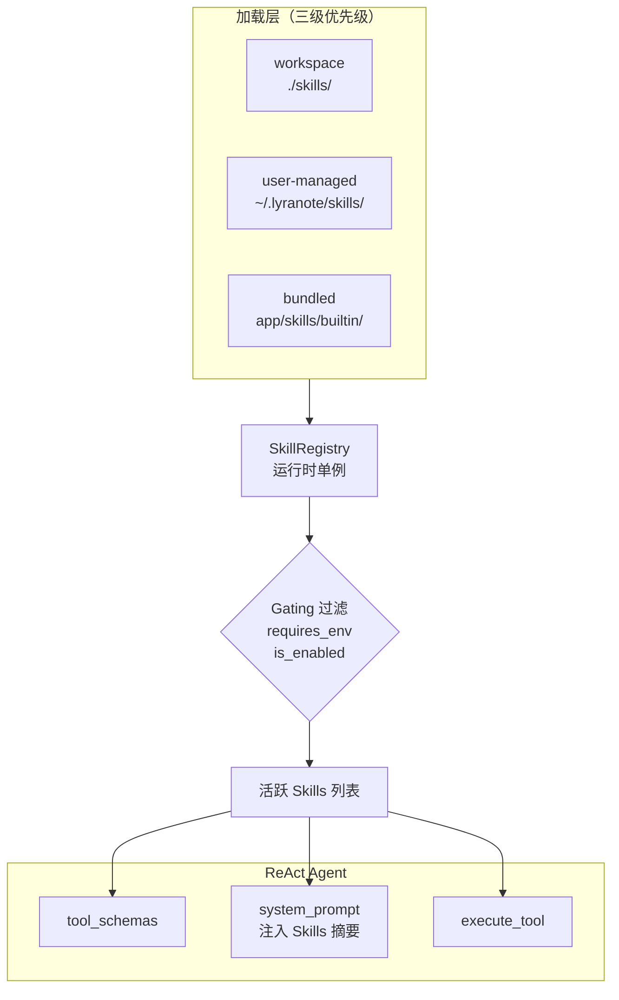

# 技能系统

LyraNote 的 AI Agent 建立在**可插拔技能系统**之上 — Agent 能够使用的每个工具都以独立 Skill 的形式实现，可以独立启用、禁用或配置。

## 为什么需要技能系统？

没有这套架构时，Agent 工具被硬编码在单个文件中：

```python
TOOL_SCHEMAS: list[dict] = [...]   # 6 个固定工具 Schema
_EXECUTORS: dict = {...}           # 6 个固定执行函数
```

这导致无法：
- 在不改代码的情况下按用户粒度启用/禁用工具
- 让用户配置工具参数（如最大搜索结果数）
- 在不修改 Agent 核心代码的情况下添加新工具
- 未来支持社区贡献的扩展 Skill

技能系统解决了所有这些问题。

## 架构概览



**加载优先级**（高优先级覆盖低优先级）：
1. Workspace Skills — `./skills/*.py`
2. 用户管理的 Skills — `~/.lyranote/skills/*.py`
3. 内置 Skills — `app/skills/builtin/`

## 内置技能列表

| Skill | 分类 | 必需环境变量 | 始终启用 | 可配置项 |
|---|---|---|---|---|
| `search-notebook-knowledge` | knowledge | — | 是 | `top_k`、`min_score` |
| `web-search` | web | `TAVILY_API_KEY` | 否 | `max_results`、`search_depth` |
| `summarize-sources` | knowledge | — | 否 | `max_chunks` |
| `create-note-draft` | writing | — | 否 | — |
| `update-user-preference` | memory | — | 是 | — |
| `generate-mind-map` | knowledge | — | 否 | `default_depth` |
| `scheduled-task` | productivity | — | 否 | — |

**始终启用**的 Skill 不可被禁用 — 它们是核心能力（知识检索和记忆系统）。

**Gating 机制**：带有 `requires_env` 的 Skill 在环境变量未配置时会自动排除。例如，如果未设置 `TAVILY_API_KEY`，`web-search` Skill 会静默退出，Agent 不会尝试调用它。

## 管理技能

进入**设置 → 技能**可查看所有可用技能及其当前状态。

在此页面你可以：
- **启用 / 禁用** 任何非核心 Skill
- **配置** Skill 参数（如将 `web-search` 的最大结果数设为 10）
- 查看当前会话的活跃 Skill 列表，以及所需环境变量是否已满足

## Agent 如何使用技能

当你向 AI 对话发送消息时，Agent 会：

1. 加载本次会话的活跃技能列表
2. 从这些技能中构建 OpenAI function-calling Schema 列表
3. 将技能摘要注入系统提示
4. 携带工具 Schema 调用 LLM — 由 LLM 决定使用哪个工具
5. 执行选定的工具，将结果反馈回循环

Agent 在 **ReAct 循环**（推理 + 行动）中运行：在给出最终答案之前，它可以按顺序调用多个工具，每次工具结果都会影响下一次决策。

## 编写自定义技能

每个 Skill 是继承自 `SkillBase` 的 Python 类。添加新技能只需一个文件（约 50–80 行）：

```python
# skills/my_skill.py
from app.skills.base import SkillBase, SkillMeta

class MySkill(SkillBase):
    meta = SkillMeta(
        name="my-skill",
        display_name="我的自定义技能",
        description="当用户询问关于 X 的问题时执行某些有用操作。",
        category="knowledge",
        thought_label="⚙️ 正在运行我的技能",
    )

    def get_schema(self, config=None) -> dict:
        return {
            "name": "my_skill",
            "description": self.meta.description,
            "parameters": {
                "type": "object",
                "properties": {
                    "query": {"type": "string", "description": "输入查询"},
                },
                "required": ["query"],
            },
        }

    async def execute(self, args: dict, ctx) -> str:
        query = args["query"]
        # ... 你的实现逻辑 ...
        return f"结果：{query}"

skill = MySkill()  # 模块级实例，供自动发现使用
```

将此文件放入 `./skills/`（Workspace）或 `~/.lyranote/skills/`（用户管理），下次请求时会自动发现并加载 — 开发模式下无需重启服务。
