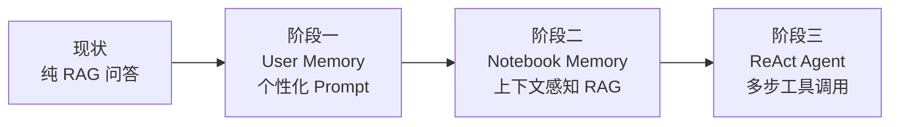
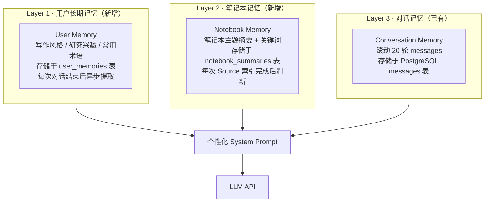
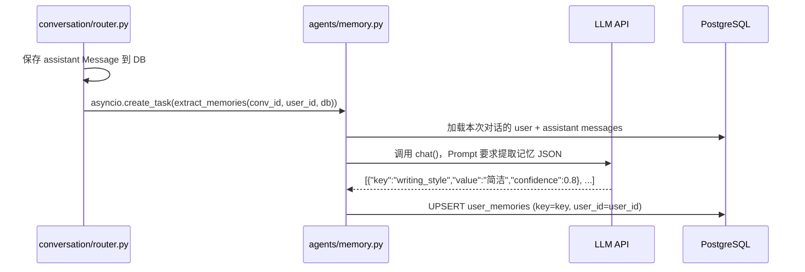
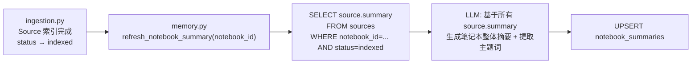
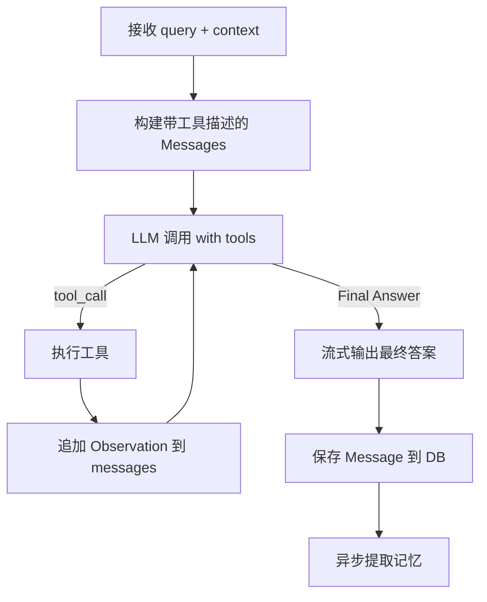

# LyraNote AI Agent + Memory 方案文档

> 版本：v0.1 · 更新：2026-03-08

---

## 1. 现状分析

### 1.1 当前 AI 能力

现有系统实现了基础 RAG（检索增强生成）流水线：

```
用户消息 → embed(query) → pgvector TOP-5 → build_messages() → LLM → 流式输出
```

**核心文件：**
- `api/app/agents/retrieval.py` — 余弦距离检索，`TOP_K=5`，`SIMILARITY_THRESHOLD=0.3`
- `api/app/agents/composer.py` — 固定 `SYSTEM_PROMPT`，拼接 context + history[-10] + query
- `api/app/providers/llm.py` — OpenAI 兼容客户端，`chat()` / `chat_stream()`

### 1.2 核心局限

| 维度 | 问题 |
|---|---|
| **无用户记忆** | System Prompt 固定不变，AI 不知道用户是谁、偏好什么风格 |
| **无跨会话记忆** | 每次刷新后历史从 localStorage 恢复，但后端每次都从零开始 |
| **无笔记本上下文** | AI 不知道这个笔记本整体在研究什么，检索全靠单次 query |
| **无主动行动能力** | 只能回答问题，不能主动总结、创建笔记、触发工具 |
| **单步推理** | `retrieve → compose` 线性，复杂问题无法分解 |

---

## 2. 升级目标



---

## 3. 三层记忆架构

### 3.1 架构总览



### 3.2 Layer 1 — 用户长期记忆（User Memory）

#### 数据模型

```python
# 新增至 api/app/models.py
class UserMemory(Base):
    __tablename__ = "user_memories"

    id: Mapped[uuid.UUID] = uuid_pk()
    user_id: Mapped[uuid.UUID] = mapped_column(
        ForeignKey("users.id", ondelete="CASCADE")
    )
    key: Mapped[str] = mapped_column(String(100))
    # 枚举值: writing_style | interest_topic | preferred_lang |
    #         technical_level | domain_expertise | output_preference
    value: Mapped[str] = mapped_column(Text)
    confidence: Mapped[float] = mapped_column(default=0.5)
    # 0.0-1.0，越高越可信；低于 0.3 不注入 Prompt
    updated_at: Mapped[datetime] = mapped_column(
        DateTime(timezone=True), server_default=func.now(), onupdate=func.now()
    )
```

#### 记忆提取流程（异步，对话完成后触发）



**提取 Prompt（`api/app/agents/memory.py`）：**

```python
MEMORY_EXTRACTION_PROMPT = """
分析以下对话，提取关于用户的持久性偏好或特征。
只提取高置信度（>0.6）的信息，不要猜测。
以 JSON 数组格式返回，每项包含：
- key: 以下之一：writing_style / interest_topic / technical_level /
       preferred_lang / domain_expertise / output_preference
- value: 具体描述（中文，20字以内）
- confidence: 0.0-1.0

对话内容：
{conversation}

只返回 JSON 数组，无其他内容。
"""
```

#### 注入到 System Prompt

```python
# api/app/agents/composer.py 修改
async def build_personalized_system_prompt(user_memories: list[dict]) -> str:
    high_conf = [m for m in user_memories if m["confidence"] >= 0.3]
    if not high_conf:
        return SYSTEM_PROMPT  # 无记忆时退回默认

    mem_lines = "\n".join(f"- {m['key']}: {m['value']}" for m in high_conf)
    return f"""{SYSTEM_PROMPT}

关于这位用户，你已了解以下信息，请据此调整回答风格和侧重：
{mem_lines}"""
```

**效果示例：**

| 用户行为 | 提取的记忆 | AI 行为变化 |
|---|---|---|
| 总是要求"精简一点" | `writing_style: 简洁直接` | 回答默认更短，避免废话 |
| 多次问 ML 相关问题 | `interest_topic: 机器学习` | 类比和举例优先使用 ML 场景 |
| 问题总是很技术化 | `technical_level: 专家级` | 不解释基础概念，直接深入 |

---

### 3.3 Layer 2 — 笔记本记忆（Notebook Memory）

#### 数据模型

```python
# 新增至 api/app/models.py
class NotebookSummary(Base):
    __tablename__ = "notebook_summaries"

    notebook_id: Mapped[uuid.UUID] = mapped_column(
        ForeignKey("notebooks.id", ondelete="CASCADE"),
        primary_key=True
    )
    summary_md: Mapped[str | None] = mapped_column(Text)
    key_themes: Mapped[list | None] = mapped_column(JSONB)
    # ["机器学习", "Transformer架构", "注意力机制"]
    last_synced_at: Mapped[datetime] = mapped_column(DateTime(timezone=True))
```

#### 刷新时机



#### 注入到 RAG 上下文

在 `_build_messages()` 中，将笔记本摘要作为"前置背景知识"注入，提升 retrieval 后的 reranking 效果：

```python
# 修改 composer.py 的 _build_messages
def _build_messages(query, context, history, notebook_summary=None, user_memories=None):
    system = await build_personalized_system_prompt(user_memories or [])
    messages = [{"role": "system", "content": system}]

    if notebook_summary:
        messages.append({
            "role": "user",
            "content": f"关于这个笔记本的背景：\n{notebook_summary['summary_md']}\n"
                       f"核心主题：{', '.join(notebook_summary['key_themes'] or [])}"
        })
        messages.append({
            "role": "assistant",
            "content": "了解，我会在这个研究背景下回答你的问题。"
        })

    # ... 原有 context + history + query
```

---

### 3.4 Layer 3 — 对话记忆（已有，强化）

当前：后端每次加载最近 20 条 messages（`conversation/router.py`）

**强化方向：**

| 强化点 | 方案 |
|---|---|
| 长对话压缩 | 超过 40 轮时，自动调用 LLM 对前 20 轮生成摘要，替换为一条 `role=system` 的 summary message |
| 跨会话延续 | 在 `Conversation` 表增加 `summary` 字段，关闭对话时生成摘要；新建对话时注入上一次对话摘要 |

---

## 4. ReAct Agent 方案

### 4.1 什么是 ReAct

ReAct（Reasoning + Acting）让 LLM 在回答前先"思考"并决定是否调用工具，循环直到得出最终答案。

```
Thought: 用户想了解这篇论文的核心贡献，我需要先检索相关内容
Action: search_notebook_knowledge("核心贡献 创新点")
Observation: [找到 3 条相关块...]
Thought: 已有足够信息，可以回答了
Final Answer: 这篇论文的核心贡献是...
```

### 4.2 工具注册表（`api/app/agents/tools.py`）

```python
TOOLS = [
    {
        "name": "search_notebook_knowledge",
        "description": "在当前笔记本的知识库中搜索与问题相关的内容。"
                       "输入：搜索查询字符串。"
                       "输出：最相关的文档片段列表。",
        "parameters": {
            "type": "object",
            "properties": {
                "query": {"type": "string", "description": "搜索查询"}
            },
            "required": ["query"]
        }
    },
    {
        "name": "summarize_sources",
        "description": "对指定来源生成摘要、FAQ 或学习指南。",
        "parameters": {
            "type": "object",
            "properties": {
                "artifact_type": {
                    "type": "string",
                    "enum": ["summary", "faq", "study_guide", "briefing"]
                }
            },
            "required": ["artifact_type"]
        }
    },
    {
        "name": "create_note_draft",
        "description": "直接在笔记本中创建一篇笔记草稿。",
        "parameters": {
            "type": "object",
            "properties": {
                "title": {"type": "string"},
                "content": {"type": "string", "description": "Markdown 格式内容"}
            },
            "required": ["title", "content"]
        }
    },
    {
        "name": "update_user_preference",
        "description": "记录用户表达的明确偏好，如：'我以后回答要简短一些'。",
        "parameters": {
            "type": "object",
            "properties": {
                "key": {"type": "string"},
                "value": {"type": "string"},
                "confidence": {"type": "number"}
            },
            "required": ["key", "value"]
        }
    }
]
```

### 4.3 Agent 循环（`api/app/agents/react_agent.py`）



**核心实现逻辑：**

```python
# api/app/agents/react_agent.py
MAX_ITERATIONS = 5  # 防止无限循环

async def run_agent(
    query: str,
    notebook_id: str,
    user_id: str,
    history: list[dict],
    db: AsyncSession,
    user_memories: list[dict],
    notebook_summary: dict | None,
) -> AsyncGenerator[dict, None]:

    messages = await _build_initial_messages(
        query, history, user_memories, notebook_summary
    )
    tool_context = ToolContext(notebook_id=notebook_id, user_id=user_id, db=db)

    for iteration in range(MAX_ITERATIONS):
        response = await llm_with_tools(messages, tools=TOOLS)

        if response.finish_reason == "tool_calls":
            for tool_call in response.tool_calls:
                yield {"type": "tool_call", "tool": tool_call.name, "input": tool_call.arguments}

                result = await execute_tool(tool_call, tool_context)
                yield {"type": "tool_result", "content": str(result)[:200]}  # 预览

                messages.append({"role": "assistant", "tool_calls": [tool_call]})
                messages.append({"role": "tool", "content": str(result), "tool_call_id": tool_call.id})

        elif response.finish_reason == "stop":
            # 流式输出最终答案
            async for token in stream_final_answer(messages):
                yield {"type": "token", "content": token}

            yield {"type": "citations", "citations": tool_context.collected_citations}
            yield {"type": "done"}
            return

    # 超出最大迭代次数，直接回答
    yield {"type": "token", "content": "（已达到最大推理步数，以下为当前信息的直接回答）\n"}
    async for token in stream_final_answer(messages):
        yield {"type": "token", "content": token}
    yield {"type": "done"}
```

### 4.4 新增 SSE 事件类型

前端 `ai-service.ts` 需要处理新增事件：

| 事件类型 | 字段 | 含义 |
|---|---|---|
| `token` | `content: string` | 输出 token（已有） |
| `citations` | `citations: []` | 引用列表（已有） |
| `done` | — | 流结束（已有） |
| `thought` | `content: string` | Agent 思考过程（新增） |
| `tool_call` | `tool: string, input: {}` | 正在调用工具（新增） |
| `tool_result` | `content: string` | 工具返回预览（新增） |

**前端展示示例（`copilot-panel.tsx` 中可折叠的 thinking block）：**

```
┌─ 正在思考... ─────────────────────────────┐
│ 🔍 搜索知识库："Transformer 注意力机制"       │
│ ✓ 找到 4 条相关内容                         │
└───────────────────────────────────────────┘
根据你的笔记本资料，Transformer 的核心创新是...
```

---

## 5. 数据库变更

### 新增两张表（Alembic 迁移 `002_memory_tables.py`）

```python
# user_memories: 用户长期记忆键值对
op.create_table("user_memories",
    sa.Column("id", UUID(as_uuid=True), primary_key=True, default=uuid.uuid4),
    sa.Column("user_id", UUID(as_uuid=True),
              sa.ForeignKey("users.id", ondelete="CASCADE"), nullable=False),
    sa.Column("key", sa.String(100), nullable=False),
    sa.Column("value", sa.Text, nullable=False),
    sa.Column("confidence", sa.Float, default=0.5),
    sa.Column("updated_at", sa.DateTime(timezone=True), server_default=func.now()),
)
op.create_index("ix_user_memories_user_key", "user_memories", ["user_id", "key"], unique=True)

# notebook_summaries: 笔记本级语义摘要
op.create_table("notebook_summaries",
    sa.Column("notebook_id", UUID(as_uuid=True),
              sa.ForeignKey("notebooks.id", ondelete="CASCADE"), primary_key=True),
    sa.Column("summary_md", sa.Text),
    sa.Column("key_themes", postgresql.JSONB),
    sa.Column("last_synced_at", sa.DateTime(timezone=True), server_default=func.now()),
)
```

---

## 6. 实施路线

### 阶段一：User Memory（约 2 天）

**目标：** AI 回答开始个性化，用户能感知到"它记住我了"

| 任务 | 文件 |
|---|---|
| 新增 `UserMemory` ORM 模型 | `api/app/models.py` |
| Alembic 迁移 `002_memory_tables.py` | `api/alembic/versions/` |
| 新增 `extract_memories()` | `api/app/agents/memory.py` |
| 新增 `inject_memories_to_prompt()` | `api/app/agents/memory.py` |
| 修改 `_build_messages()` 注入记忆 | `api/app/agents/composer.py` |
| 修改 `stream_message` 对话完成后触发提取 | `api/app/domains/conversation/router.py` |

### 阶段二：Notebook Memory（约 1 天）

**目标：** RAG 检索更精准，AI 知道"这个笔记本在研究什么"

| 任务 | 文件 |
|---|---|
| 新增 `NotebookSummary` ORM 模型 | `api/app/models.py` |
| 新增 `refresh_notebook_summary()` | `api/app/agents/memory.py` |
| 修改 `ingest()` 完成后调用刷新 | `api/app/agents/ingestion.py` |
| 修改 `_build_messages()` 注入笔记本摘要 | `api/app/agents/composer.py` |

### 阶段三：ReAct Agent（约 3 天）

**目标：** AI 具备多步推理能力，可主动使用工具

| 任务 | 文件 |
|---|---|
| 新增工具注册表 | `api/app/agents/tools.py` |
| 新增 Agent 循环 | `api/app/agents/react_agent.py` |
| 修改 `stream_message` 替换为 `run_agent()` | `api/app/domains/conversation/router.py` |
| 前端处理 `thought`/`tool_call` SSE 事件 | `web/src/services/ai-service.ts` |
| 前端展示思考过程 UI | `web/src/features/copilot/copilot-panel.tsx` |

---

## 7. 效果对比

### 升级前

```
用户：这篇论文的核心贡献是什么？
AI：根据你的笔记本资料，[来源1] 中提到...（每次一样的回答方式）
```

### 升级后（三层记忆 + ReAct）

```
用户：这篇论文的核心贡献是什么？

┌─ 正在思考... ──────────────────────────────┐
│ 🔍 搜索："论文核心贡献 创新点"                │
│ ✓ 找到 5 条相关内容（相关度 0.82）            │
└────────────────────────────────────────────┘

[记忆注入：technical_level=专家级，interest_topic=注意力机制]

该论文提出了 Flash Attention 2，核心创新有三点：
1. 将 IO 复杂度从 O(N²) 降至 O(N)...
（回答更精准，风格匹配用户专业水平，引用准确）
```

---

## 8. 关键设计决策

| 决策点 | 选择 | 理由 |
|---|---|---|
| 记忆提取时机 | 对话结束后异步（`asyncio.create_task`） | 不阻塞流式响应，用户体感好 |
| 记忆存储方式 | 结构化键值对 + confidence | 可审计、可删除、易于查询注入 |
| Agent 框架 | 自实现 ReAct 而非 LangChain | 更轻量，避免 LangChain 版本不兼容，与现有代码融合更紧密 |
| 工具调用协议 | OpenAI Function Calling（`tools` 参数） | 与现有 llm.py provider 一致，支持所有兼容接口 |
| 最大迭代次数 | `MAX_ITERATIONS=5` | 防止 token 浪费和无限循环，实测 95% 的问题 2 轮内解决 |
| 笔记本摘要触发 | Source 索引完成时刷新（增量） | 避免每次对话都重新生成，降低 LLM 调用成本 |
