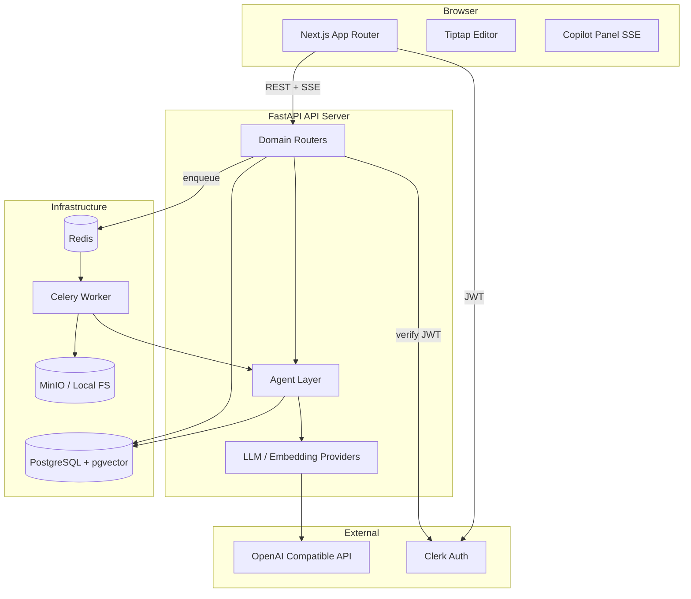
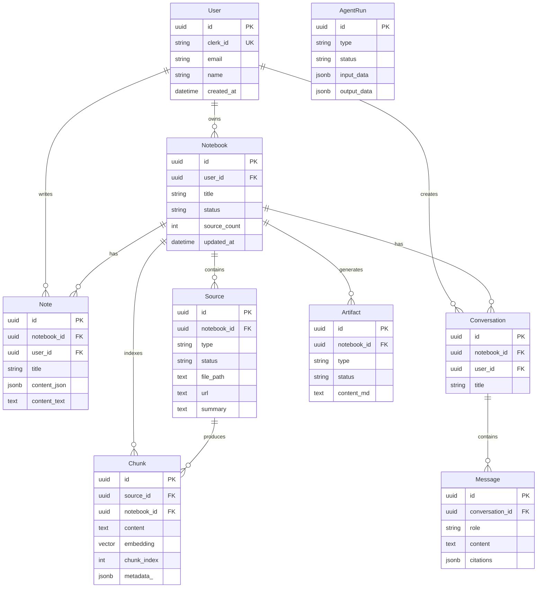
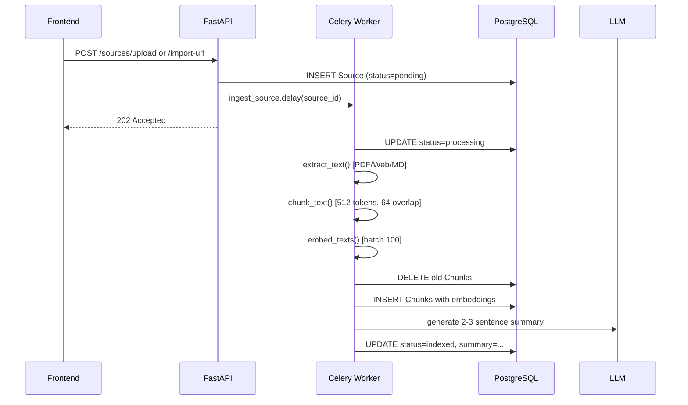
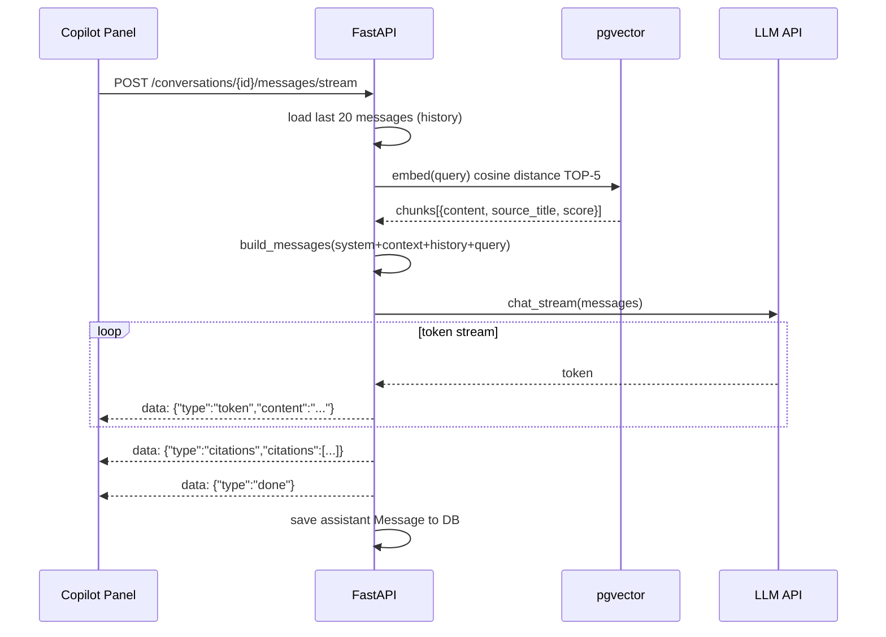
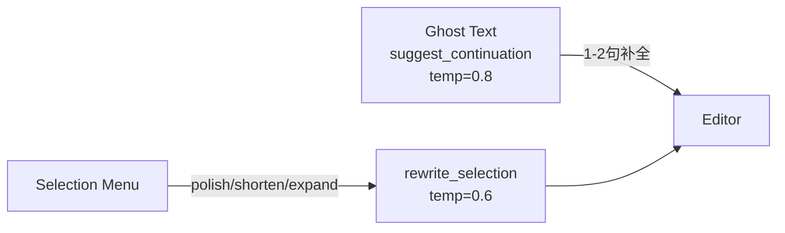
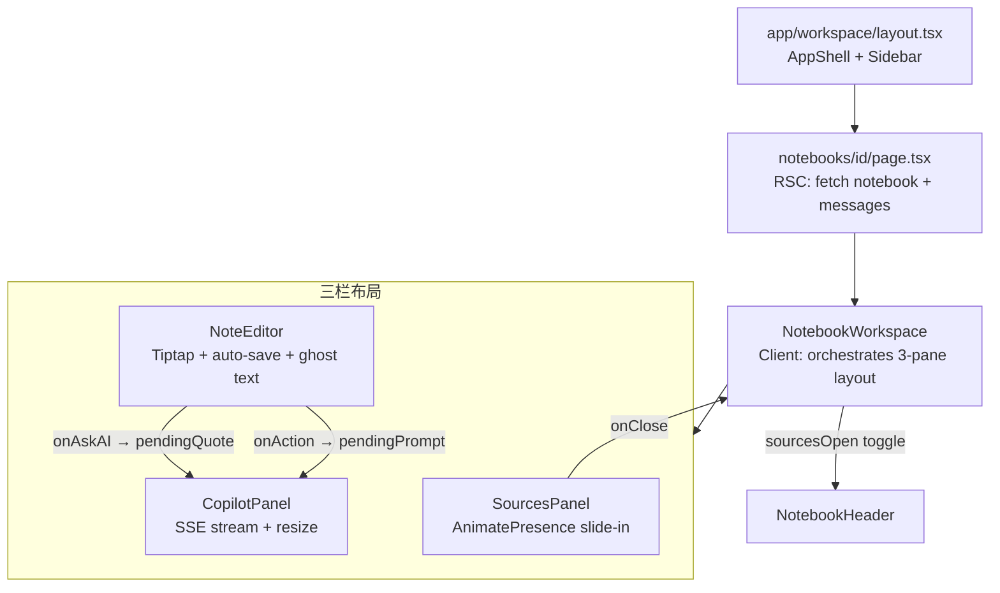
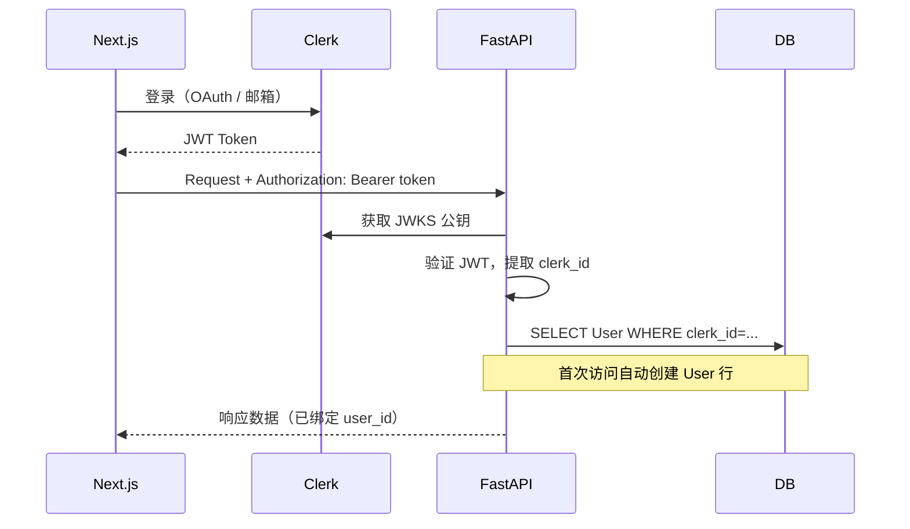
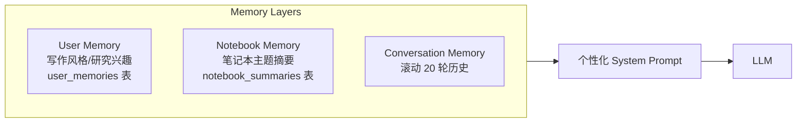
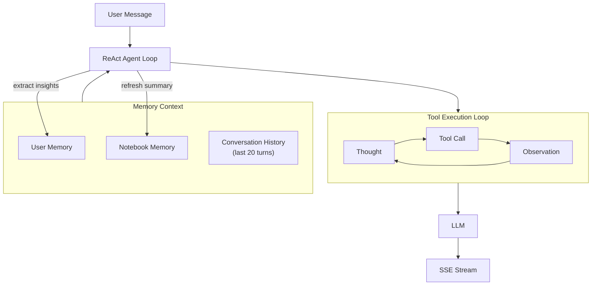

# LyraNote 系统架构文档

> 版本：v0.1 · 更新：2026-03-08

## 1. 项目概述

LyraNote 是一款以 AI 为核心的研究笔记应用。用户可将论文、网页、本地文件导入"笔记本"作为知识来源，AI 基于这些来源进行 RAG 检索问答、内联写作辅助和结构化产出物生成。

**核心用户价值**

- 统一管理多来源知识（PDF、网页、Markdown）
- AI 对话基于用户自有知识库而非通用互联网
- 编辑器内嵌 AI 辅助（Ghost Text、改写、扩写）
- 一键生成摘要、FAQ、学习指南等结构化产出物

---

## 2. 技术栈

### 前端

| 层级 | 技术 |
|---|---|
| 框架 | Next.js 15 App Router（RSC + Server Actions） |
| UI 组件 | Shadcn UI + Radix UI + Tailwind CSS |
| 富文本编辑器 | Tiptap v2（ProseMirror） |
| 动画 | Framer Motion |
| 状态管理 | Zustand（UI 状态）+ TanStack Query v5（服务端状态） |
| HTTP 客户端 | Axios（封装于 `lib/axios.ts`） |
| 流式通信 | Server-Sent Events（SSE） |
| 身份认证 | Clerk |
| 国际化 | next-intl |

### 后端

| 层级 | 技术 |
|---|---|
| 框架 | FastAPI（Python 3.12） |
| ORM | SQLAlchemy 2.x Async（asyncpg 驱动） |
| 数据库 | PostgreSQL 16 + pgvector 扩展 |
| 任务队列 | Celery + Redis |
| LLM 接入 | OpenAI 兼容接口（支持 DeepSeek、Ollama 等） |
| 向量嵌入 | `text-embedding-3-small`（1536 维） |
| 文件存储 | 本地 FS 或 MinIO（S3 兼容） |
| 鉴权 | Clerk JWKS JWT 验证 |
| 文档解析 | pypdf（PDF）、httpx + BeautifulSoup（网页）、langchain-text-splitters |

### 基础设施

```
docker-compose.yml
├── postgres:16   (端口 5432)
├── pgvector      (扩展，随 lifespan 自动创建)
├── redis:7       (端口 6379，Celery broker)
└── minio         (端口 9000，可选对象存储)
```

---

## 3. 目录结构

### 后端 `api/`

```
api/
├── app/
│   ├── main.py              # FastAPI 应用入口，注册路由、CORS、lifespan
│   ├── config.py            # Pydantic Settings（从 .env 加载）
│   ├── database.py          # AsyncEngine、sessionmaker、get_db 依赖
│   ├── dependencies.py      # CurrentUser、DbDep 类型别名
│   ├── auth.py              # Clerk JWKS JWT 验证
│   ├── models.py            # 全部 SQLAlchemy ORM 模型
│   ├── agents/
│   │   ├── ingestion.py     # 来源解析 → 分块 → 嵌入 → pgvector 写入
│   │   ├── retrieval.py     # 查询嵌入 → 余弦距离检索 Top-K 块
│   │   ├── composer.py      # RAG 提示构建 → LLM → 流式输出 + 引用
│   │   └── writing.py       # Ghost Text 补全 + 选中文本改写
│   ├── providers/
│   │   ├── llm.py           # OpenAI 兼容客户端封装（chat / chat_stream）
│   │   └── embedding.py     # 文本向量化 provider
│   ├── domains/
│   │   ├── notebook/        # CRUD 路由 + Pydantic schemas
│   │   ├── source/          # 来源上传/URL 导入 + 状态查询
│   │   ├── note/            # 笔记 CRUD（Tiptap JSON 存储）
│   │   ├── conversation/    # 对话 + 消息（流式 / 非流式）
│   │   ├── artifact/        # 产出物生成与查询
│   │   └── knowledge/       # AI 写作辅助端点（/ai/suggest、/ai/rewrite）
│   └── workers/
│       └── tasks.py         # Celery 异步任务（ingest_source）
└── alembic/                 # 数据库迁移
    └── versions/
        └── 001_initial_schema.py
```

### 前端 `web/src/`

```
web/src/
├── app/
│   ├── (auth)/              # Clerk 登录/注册页
│   ├── (marketing)/         # 落地页
│   └── (workspace)/
│       ├── layout.tsx       # AppShell（Sidebar + 主内容区）
│       └── app/
│           ├── page.tsx              # 主页（快速访问）
│           ├── notebooks/
│           │   ├── page.tsx          # 笔记本列表
│           │   └── [id]/page.tsx     # 笔记本详情（NotebookWorkspace）
│           ├── chat/page.tsx         # 全局对话视图
│           ├── knowledge/page.tsx    # 知识库视图
│           └── settings/page.tsx    # 设置（intercepted modal）
├── features/                # 按业务域划分的功能模块
│   ├── notebook/            # 笔记本卡片、列表、工作区、页头
│   ├── editor/              # Tiptap 编辑器（自动保存、工具栏、选中菜单）
│   ├── copilot/             # AI 对话面板（流式、引用、拖拽调宽）
│   ├── source/              # 来源面板、导入对话框、来源阅读器
│   ├── artifacts/           # 产出物卡片和 Studio 面板
│   └── knowledge/           # 全局知识库视图
├── services/                # API 调用层（抛 user-friendly 错误）
├── store/                   # Zustand stores
├── lib/                     # 第三方初始化（axios、tiptap 扩展）
├── hooks/                   # 全局 hooks
├── types/                   # TypeScript 接口
└── utils/                   # 纯工具函数
```

---

## 4. 整体架构



---

## 5. 数据库设计

### ER 图



### 外键级联策略

所有子表的 `notebook_id`、`user_id` 等 FK 均设置 `ON DELETE CASCADE`，SQLAlchemy 关系均配置 `passive_deletes=True`，由数据库层执行级联删除。

---

## 6. AI 流水线

### 6.1 知识库构建（Source Ingestion）



### 6.2 RAG 问答（Streaming）



**关键参数**

- 检索：`TOP_K=5`，`SIMILARITY_THRESHOLD=0.3`，余弦距离（pgvector `<=>` 运算符）
- 历史：滚动最近 20 条消息
- 向量维度：1536（`text-embedding-3-small`）
- 分块：`CHUNK_SIZE=512`，`CHUNK_OVERLAP=64`（RecursiveCharacterTextSplitter）

### 6.3 内联写作 AI



---

## 7. API 端点总览

| 方法 | 路径 | 功能 |
|---|---|---|
| GET | `/api/v1/notebooks` | 列出笔记本 |
| POST | `/api/v1/notebooks` | 创建笔记本 |
| GET | `/api/v1/notebooks/{id}` | 获取单个笔记本 |
| PATCH | `/api/v1/notebooks/{id}` | 重命名笔记本 |
| DELETE | `/api/v1/notebooks/{id}` | 删除笔记本（级联） |
| GET | `/api/v1/notebooks/{id}/sources` | 列出来源 |
| POST | `/api/v1/notebooks/{id}/sources/upload` | 上传文件来源 |
| POST | `/api/v1/notebooks/{id}/sources/import-url` | 导入 URL 来源 |
| DELETE | `/api/v1/sources/{id}` | 删除来源 |
| GET | `/api/v1/notebooks/{id}/notes` | 列出笔记 |
| POST | `/api/v1/notebooks/{id}/notes` | 创建笔记 |
| PATCH | `/api/v1/notes/{id}` | 更新笔记（自动保存） |
| GET | `/api/v1/notebooks/{id}/conversations` | 列出对话 |
| POST | `/api/v1/notebooks/{id}/conversations` | 创建对话 |
| POST | `/api/v1/conversations/{id}/messages` | 非流式问答 |
| POST | `/api/v1/conversations/{id}/messages/stream` | SSE 流式问答 |
| GET | `/api/v1/notebooks/{id}/artifacts` | 列出产出物 |
| POST | `/api/v1/notebooks/{id}/artifacts/generate` | 生成产出物 |
| POST | `/api/v1/ai/suggest` | Ghost Text 补全 |
| POST | `/api/v1/ai/rewrite` | 选中文本改写 |
| GET | `/api/v1/jobs/{job_id}` | 查询异步任务状态 |
| GET | `/health` | 健康检查 |

---

## 8. 前端核心组件关系



### 状态管理

| Store | 管理内容 |
|---|---|
| `useUiStore` | `importDialogOpen`（全局导入来源弹窗） |
| `useNotebookStore` | `activeSourceId`（当前阅读来源） |
| `useAuthStore` | 用户登录状态 |
| 组件本地 state | 聊天消息（+ localStorage 持久化）、编辑器内容、面板宽度 |

---

## 9. 鉴权流程



**Debug 模式**：`settings.debug=True` 时跳过 JWT 验证，使用 `clerk_id="dev_user"` 的开发用户，无需 Clerk 配置即可本地运行。

---

## 10. 规划中的 AI 升级（Agent + Memory）

当前系统已具备 RAG 基础能力。计划升级方向：

### 三层记忆架构



### ReAct Agent 工具链

未来对话入口将从线性 `retrieve → compose` 升级为多步工具循环：

| Tool | 作用 |
|---|---|
| `search_notebook_knowledge` | 向量检索（现有） |
| `summarize_sources` | 触发产出物生成 |
| `create_note_draft` | 直接写入笔记 |
| `update_user_preference` | 主动记录用户偏好 |
| `web_search` | 联网补充知识 |

### 升级后数据流



---

## 11. 本地开发启动

```bash
# 启动基础设施
docker-compose up -d

# 后端
cd api
cp .env.example .env   # 填入 OPENAI_API_KEY 等
uv sync
alembic upgrade head
uvicorn app.main:app --reload --port 8000

# 前端
cd web
pnpm install
pnpm dev               # http://localhost:3000

# 或一键启动
./start.sh local
```

**环境变量（最小集）**

| 变量 | 说明 |
|---|---|
| `DATABASE_URL` | PostgreSQL 连接串 |
| `REDIS_URL` | Redis 连接串 |
| `OPENAI_API_KEY` | LLM API 密钥 |
| `OPENAI_BASE_URL` | 可替换为 DeepSeek / Ollama 地址 |
| `LLM_MODEL` | 默认 `gpt-4o-mini` |
| `DEBUG` | `true` 时跳过 Clerk 鉴权 |
| `NEXT_PUBLIC_USE_MOCK` | `true` 时前端使用 Mock 数据 |
