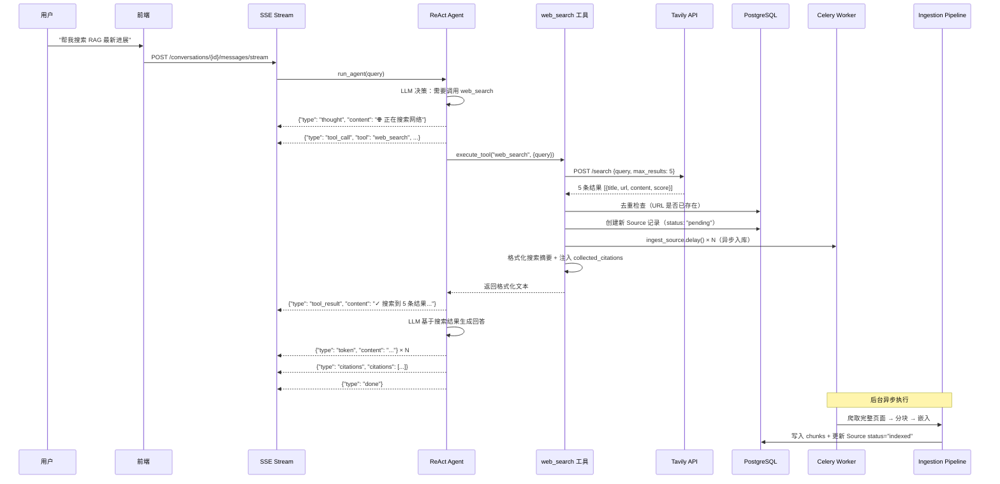
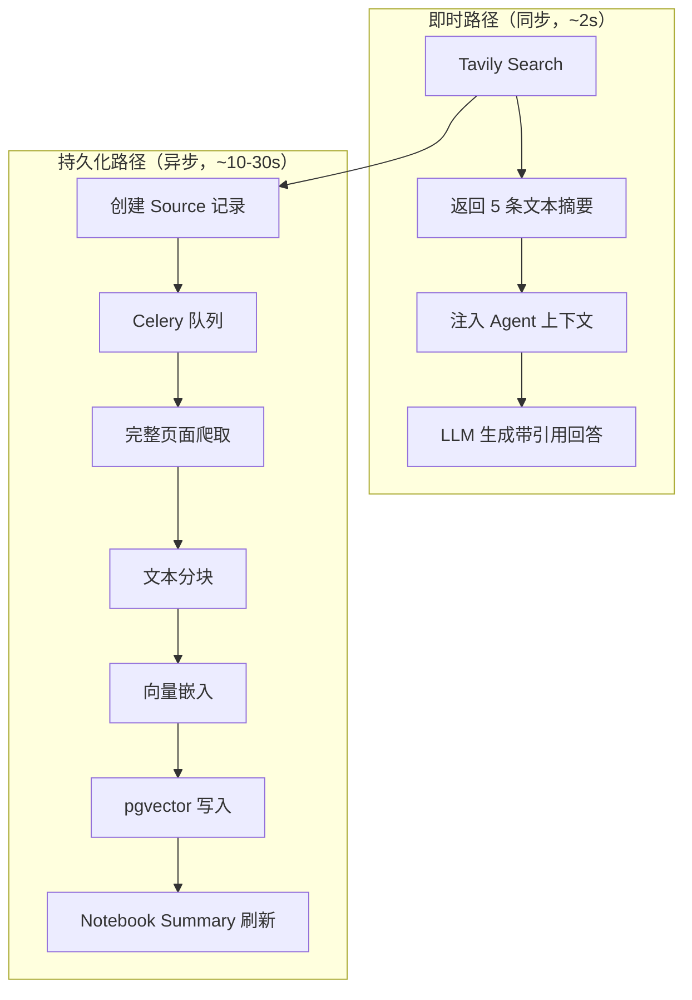
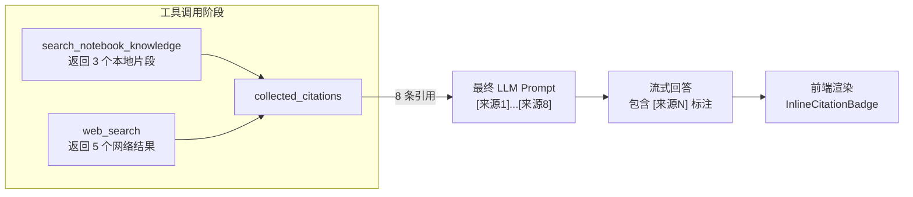

# LyraNote Web Search 工具技术方案

> 版本：v0.1 · 更新：2026-03-08

---

## 1. 背景与动机

### 1.1 现状

当前 LyraNote 的 AI 能力完全依赖**本地知识库**（用户手动上传的 PDF、网页、Markdown 文件）。ReAct Agent 拥有 4 个工具：

| 工具 | 功能 | 数据来源 |
|---|---|---|
| `search_notebook_knowledge` | 向量检索笔记本知识库 | pgvector 本地 chunks |
| `summarize_sources` | 生成摘要/FAQ/指南 | 本地 chunks |
| `create_note_draft` | 创建笔记草稿 | 无外部数据 |
| `update_user_preference` | 记录用户偏好 | 无外部数据 |

**核心局限**：当用户提出的问题超出已有知识库范围时（例如"帮我搜索 2026 年 RAG 技术的最新进展"），Agent 只能诚实地回答"未找到相关内容"，无法主动从互联网获取信息。

### 1.2 目标

新增 `web_search` 工具，使 Agent 具备以下能力：

1. **实时检索** — 调用 Tavily AI Search API，获取互联网上与用户问题最相关的内容片段
2. **自动入库** — 搜索结果的来源网页自动创建为 Source 记录，经 Celery 异步爬取 → 分块 → 向量化，持久化到知识库
3. **带引用回答** — 搜索结果以 `[来源N]` 形式参与引用，与本地知识库检索结果统一展示

---

## 2. 技术选型：Tavily AI Search

### 2.1 为什么选择 Tavily

| 维度 | Tavily | Serper.dev | DuckDuckGo | Jina Reader |
|---|---|---|---|---|
| **面向对象** | AI Agent 专用 | 通用搜索镜像 | 通用搜索 | URL → 文本 |
| **返回格式** | 清洗后的文本片段 | 原始 Google JSON | HTML 摘要 | Markdown |
| **Rerank** | 内置 LLM Rerank | 无 | 无 | 无 |
| **去广告** | 自动过滤 | 需自行处理 | 部分 | 不适用 |
| **RAG 适配** | 原生支持 | 需额外处理 | 需额外处理 | 仅转换 |
| **LangChain 集成** | 官方 Tool | 社区 Wrapper | 社区 | 无 |
| **免费额度** | 1000 次/月 | 2500 次/月 | 无限（不稳定） | 有限 |

Tavily 是当前 AI Agent 领域的标杆搜索 API，专为 LLM 设计：
- 返回经过清洗、Rerank 的文本片段，不是原始 HTML
- 自带"搜索 + 内容提取"功能，直接返回 citation-ready 内容
- 深度集成于 LangChain / LangGraph 生态

### 2.2 Tavily API 概览

**端点**：`POST https://api.tavily.com/search`

**请求体**：
```json
{
  "api_key": "tvly-xxxxx",
  "query": "RAG 技术 2026 最新进展",
  "search_depth": "basic",
  "max_results": 5,
  "include_answer": false,
  "include_raw_content": false
}
```

**响应体**：
```json
{
  "query": "RAG 技术 2026 最新进展",
  "results": [
    {
      "title": "RAG 2.0: 检索增强生成的新范式",
      "url": "https://example.com/rag-2026",
      "content": "2026 年，RAG 技术经历了从简单检索到多步推理的演进...",
      "score": 0.95,
      "raw_content": null
    }
  ]
}
```

| 参数 | 类型 | 说明 |
|---|---|---|
| `search_depth` | `"basic"` / `"advanced"` | basic 更快（~1s），advanced 更深入（~3-5s，会爬取页面） |
| `max_results` | int | 返回结果数量，1-10 |
| `include_raw_content` | bool | 是否返回完整页面内容（advanced 模式下有效） |
| `include_answer` | bool | 是否同时返回 Tavily 的 AI 摘要 |

---

## 3. 系统架构

### 3.1 整体流程



### 3.2 双路径设计

Web Search 采用"**即时回答 + 异步入库**"的双路径策略：



**设计意图**：

- **即时路径**：用户等待时间仅为 Tavily API 的响应延迟（~1-2s），不需要等待完整的入库流水线
- **持久化路径**：搜索到的网页自动成为笔记本的知识来源，后续对话可直接通过 `search_notebook_knowledge` 检索，无需重复搜索

---

## 4. 详细实现

### 4.1 新增文件：`api/app/providers/tavily.py`

Tavily Python SDK (`tavily-python`) 是同步的，不适合 FastAPI 的 async 架构。我们直接使用已有的 `httpx` 异步客户端调用 REST API。

```python
"""
Tavily AI Search Provider.

Thin async wrapper around Tavily REST API using httpx.
Avoids the synchronous tavily-python SDK to stay compatible with
the FastAPI async event loop.
"""

from __future__ import annotations

import logging

import httpx

from app.config import settings

logger = logging.getLogger(__name__)

TAVILY_API_URL = "https://api.tavily.com/search"


async def search(
    query: str,
    *,
    max_results: int = 5,
    search_depth: str = "basic",
) -> list[dict]:
    """
    调用 Tavily Search API。

    返回格式：
    [
        {
            "title": "...",
            "url": "https://...",
            "content": "清洗后的文本摘要",
            "score": 0.95,
            "raw_content": "完整页面文本（advanced 模式）"
        },
        ...
    ]
    """
    if not settings.tavily_api_key:
        logger.warning("TAVILY_API_KEY not configured, web search disabled")
        return []

    payload = {
        "api_key": settings.tavily_api_key,
        "query": query,
        "max_results": max_results,
        "search_depth": search_depth,
        "include_answer": False,
        "include_raw_content": search_depth == "advanced",
    }

    async with httpx.AsyncClient(timeout=30) as client:
        resp = await client.post(TAVILY_API_URL, json=payload)
        resp.raise_for_status()

    data = resp.json()
    return data.get("results", [])
```

**设计要点**：

- 不引入新依赖（`httpx` 已在 `requirements.txt`）
- `search_depth="basic"` 时不请求 `raw_content`，减少响应体积和延迟
- API Key 缺失时 graceful 降级，返回空列表而非报错

### 4.2 配置变更：`api/app/config.py`

```python
class Settings(BaseSettings):
    # ...已有配置...

    # Tavily AI Search
    tavily_api_key: str = ""
```

对应 `.env` 新增：

```env
TAVILY_API_KEY=tvly-xxxxxxxxxxxxxxxxxxxxxxxxxx
```

### 4.3 工具注册：`api/app/agents/tools.py`

#### 4.3.1 新增 Schema

```python
{
    "name": "web_search",
    "description": (
        "在互联网上搜索最新信息。"
        "当笔记本知识库中没有足够信息，或用户明确要求搜索网络、查找最新资讯时调用此工具。"
        "搜索结果会自动保存到笔记本知识库中供后续使用。"
    ),
    "parameters": {
        "type": "object",
        "properties": {
            "query": {
                "type": "string",
                "description": "搜索查询关键词，应简洁且语义明确",
            },
            "search_depth": {
                "type": "string",
                "enum": ["basic", "advanced"],
                "description": "搜索深度：basic=快速搜索（默认），advanced=深度搜索（更慢但结果更全面）",
            },
        },
        "required": ["query"],
    },
}
```

#### 4.3.2 新增 Executor

```python
async def _exec_web_search(args: dict, ctx: ToolContext) -> str:
    """
    执行流程：
    1. 调用 Tavily Search API
    2. 去重检查（URL 是否已存在于当前笔记本）
    3. 为新 URL 创建 Source 记录并异步入库
    4. 将搜索结果注入 collected_citations
    5. 返回格式化文本供 Agent 使用
    """
    from sqlalchemy import select
    from app.models import Source
    from app.providers import tavily

    query = args.get("query", "")
    search_depth = args.get("search_depth", "basic")

    # Step 1: 调用 Tavily
    results = await tavily.search(
        query,
        max_results=5,
        search_depth=search_depth,
    )

    if not results:
        return "网络搜索未返回结果，请尝试更换关键词。"

    # Step 2: 查询当前笔记本已有的 URL，用于去重
    existing_urls_result = await ctx.db.execute(
        select(Source.url).where(
            Source.notebook_id == UUID(ctx.notebook_id),
            Source.url.isnot(None),
        )
    )
    existing_urls = set(existing_urls_result.scalars().all())

    # Step 3 & 4: 处理每条结果
    new_source_count = 0
    result_parts = []

    for i, r in enumerate(results, 1):
        title = r.get("title", "未知标题")
        url = r.get("url", "")
        content = r.get("content", "")
        score = r.get("score", 0.0)

        # 注入到 collected_citations
        citation_id = f"web-{i}"
        ctx.collected_citations.append({
            "source_id": citation_id,
            "chunk_id": f"web-search-{i}",
            "excerpt": content[:200],
            "source_title": title,
            "score": score,
        })

        # 格式化输出
        result_parts.append(
            f"[结果{i}] 《{title}》（相关度 {score:.0%}）\n"
            f"链接：{url}\n"
            f"{content[:500]}"
        )

        # 创建 Source 并异步入库（去重）
        if url and url not in existing_urls:
            source = Source(
                notebook_id=UUID(ctx.notebook_id),
                title=title,
                type="web",
                status="pending",
                url=url,
            )
            ctx.db.add(source)
            await ctx.db.flush()
            await ctx.db.refresh(source)

            from app.workers.tasks import ingest_source
            ingest_source.delay(str(source.id))

            existing_urls.add(url)
            new_source_count += 1

    # 尾部提示
    footer = f"\n\n---\n共搜索到 {len(results)} 条结果"
    if new_source_count > 0:
        footer += f"，其中 {new_source_count} 个新来源正在后台导入到知识库"

    return "\n\n".join(result_parts) + footer
```

#### 4.3.3 注册到执行器映射

```python
_EXECUTORS = {
    "search_notebook_knowledge": _exec_search_notebook_knowledge,
    "summarize_sources": _exec_summarize_sources,
    "create_note_draft": _exec_create_note_draft,
    "update_user_preference": _exec_update_user_preference,
    "web_search": _exec_web_search,  # 新增
}
```

### 4.4 Agent 提示词更新：`api/app/agents/react_agent.py`

```python
_THOUGHT_LABELS = {
    "search_notebook_knowledge": "🔍 正在检索知识库",
    "summarize_sources": "📝 正在生成摘要",
    "create_note_draft": "✏️ 正在创建笔记",
    "update_user_preference": "💾 正在保存偏好",
    "web_search": "🌐 正在搜索网络",  # 新增
}
```

### 4.5 前端 UI：`web/src/features/copilot/agent-steps.tsx`

```typescript
const TOOL_META: Record<string, { icon: typeof Search; label: string; color: string }> = {
  // ...已有工具...
  web_search: {
    icon: Globe,           // 从 lucide-react 导入
    label: "正在搜索网络",
    color: "text-cyan-400",
  },
}
```

前端无需其他改动 — `AgentSteps` 组件已经通过 `TOOL_META` 动态匹配工具名称并渲染对应 UI。`tool_call`、`tool_result` 事件会自动展示搜索进度和结果摘要。

---

## 5. 数据流详解

### 5.1 Agent 决策逻辑

LLM 通过 Tool Schema 的 `description` 字段决定何时调用 `web_search`。关键触发场景：

| 场景 | 示例用户输入 | Agent 行为 |
|---|---|---|
| 知识库无相关内容 | "帮我搜索量子计算的最新进展" | 先 `search_notebook_knowledge` → 无结果 → `web_search` |
| 用户明确要求网络搜索 | "在网上查一下 Tavily API 的定价" | 直接 `web_search` |
| 需要最新时效性信息 | "今天有什么 AI 新闻" | 直接 `web_search` |
| 知识库已有充分内容 | "总结一下上传的论文" | 仅 `search_notebook_knowledge`，不触发 `web_search` |

### 5.2 引用集成

`web_search` 的搜索结果通过 `ctx.collected_citations` 与本地知识库检索结果统一管理：



引用编号连续：本地知识库结果 `[来源1]-[来源3]` + 网络搜索结果 `[来源4]-[来源8]`，前端 `InlineCitationBadge` 和 `ChatCitationFooter` 无需改动即可正确渲染。

### 5.3 去重策略

为避免同一 URL 被重复入库：

```
1. 用户首次搜索 "RAG 技术"
   → Tavily 返回 url-A, url-B, url-C
   → 全部创建 Source，异步入库

2. 用户再次搜索 "RAG 最新进展"
   → Tavily 返回 url-A, url-D, url-E
   → url-A 已存在，跳过
   → url-D, url-E 创建 Source，异步入库
```

去重范围限定在**当前笔记本**内，不同笔记本可以有相同 URL 的 Source（因为它们属于不同的知识域）。

---

## 6. 性能与限制

### 6.1 延迟分析

| 环节 | 预计延迟 | 说明 |
|---|---|---|
| Tavily API (basic) | 1-2s | 仅返回摘要片段 |
| Tavily API (advanced) | 3-5s | 包含深度爬取 |
| Source 创建 + 入队 | <100ms | 仅 DB insert + Redis publish |
| 总用户感知延迟 | ~2-3s | 即时路径，不等待入库 |

### 6.2 Tavily 配额

| 计划 | 月搜索次数 | 价格 |
|---|---|---|
| Free | 1,000 | $0 |
| Pro | 10,000 | $40/月 |
| Business | 100,000 | 联系销售 |

开发阶段使用 Free 计划即可。配额不足时 `tavily.search()` 返回空列表，Agent 会 fallback 到仅使用本地知识库。

### 6.3 已知限制

| 限制 | 说明 | 后续可优化方向 |
|---|---|---|
| 中文搜索质量 | Tavily 主要优化英文搜索，中文结果质量中等 | 可后续集成博查 (Bocha) API 专门处理中文互联网内容 |
| 异步入库延迟 | 搜索结果的完整页面需 10-30s 才能入库完成 | 可在前端显示"正在导入"状态提示 |
| 单次搜索上限 | 最多 10 条结果 | 可通过多次调用或 advanced 模式扩展 |

---

## 7. 文件变更清单

| 操作 | 文件路径 | 说明 |
|---|---|---|
| **新增** | `api/app/providers/tavily.py` | Tavily 异步搜索封装 |
| **修改** | `api/app/config.py` | 新增 `tavily_api_key` 配置项 |
| **修改** | `api/app/agents/tools.py` | 新增 `web_search` Schema + Executor |
| **修改** | `api/app/agents/react_agent.py` | 新增 `_THOUGHT_LABELS["web_search"]` |
| **修改** | `web/src/features/copilot/agent-steps.tsx` | 新增 `TOOL_META["web_search"]` UI 配置 |
| **修改** | `.env` | 新增 `TAVILY_API_KEY` 环境变量 |

总计：**1 个新增文件 + 4 个修改文件 + 1 个环境变量**

---

## 8. 未来扩展方向

### 8.1 短期优化

- **搜索结果预览卡片**：在前端 `tool_result` 中渲染搜索结果为可点击的卡片（标题、URL、摘要），而非纯文本
- **入库状态通知**：搜索到的来源完成入库后，通过 WebSocket 通知前端更新 SourcesPanel

### 8.2 中期演进：Search → Research

参考当前主流的 Deep Research 架构，将单步搜索升级为多步研究流程：


| 阶段 | 工具 | 说明 |
|---|---|---|
| Planner | LLM | 将复杂问题拆解为多个搜索子任务 |
| Searcher | Tavily | 并行执行多个搜索查询 |
| Reader | Firecrawl / Jina Reader | 爬取高价值链接的完整页面内容 |
| Synthesizer | LLM | 汇总所有内容，生成结构化研究报告 |

### 8.3 长期目标

- **博查 (Bocha) 集成**：专门处理中文互联网搜索（小红书、微信公众号、知乎等）
- **Exa (Neural Search) 集成**：通过 Embedding 进行语义搜索，擅长查找"难以用关键词描述"的资源
- **搜索策略路由**：Agent 根据查询语言和内容类型，自动选择最合适的搜索 API

---

## 附录 A：Tavily API 完整请求/响应示例

### 请求

```bash
curl -X POST https://api.tavily.com/search \
  -H "Content-Type: application/json" \
  -d '{
    "api_key": "tvly-xxxxxxxxxxxxxxxxxx",
    "query": "RAG retrieval augmented generation 2026 advances",
    "search_depth": "basic",
    "max_results": 3,
    "include_answer": false,
    "include_raw_content": false
  }'
```

### 响应

```json
{
  "query": "RAG retrieval augmented generation 2026 advances",
  "follow_up_questions": null,
  "answer": null,
  "images": [],
  "results": [
    {
      "title": "RAG 2.0: The Next Evolution of Retrieval-Augmented Generation",
      "url": "https://arxiv.org/abs/2601.xxxxx",
      "content": "In 2026, RAG systems have evolved beyond simple retrieve-and-generate paradigms. Key advances include multi-hop reasoning over retrieved documents, adaptive retrieval that dynamically decides when and what to retrieve, and hybrid approaches combining dense and sparse retrieval...",
      "score": 0.9823,
      "raw_content": null
    },
    {
      "title": "Building Production RAG Systems: Lessons from 2025-2026",
      "url": "https://blog.example.com/rag-production",
      "content": "Production RAG deployments in 2026 increasingly rely on three pillars: (1) reranking pipelines that go beyond cosine similarity, (2) chunk optimization strategies that preserve semantic boundaries, and (3) citation-aware generation that grounds every claim...",
      "score": 0.9567,
      "raw_content": null
    },
    {
      "title": "Survey: Retrieval-Augmented Generation for Knowledge-Intensive NLP",
      "url": "https://example.edu/survey-rag",
      "content": "This survey covers 150+ papers published between 2024-2026 on RAG techniques. We categorize advances into: retrieval improvements (learned retrievers, multi-vector representations), generation improvements (attribution, factual consistency), and system-level advances (caching, streaming)...",
      "score": 0.9234,
      "raw_content": null
    }
  ],
  "response_time": 1.23
}
```

## 附录 B：与现有工具的协作模式

### 场景：用户上传了一篇论文，然后要求 AI 搜索相关的最新研究

```
用户: 这篇论文提到的 GraphRAG 技术，帮我搜索一下最新的进展

Agent 推理过程:
  1. 思考: 用户提到了 GraphRAG，先在知识库中搜索相关内容
  2. 调用: search_notebook_knowledge(query="GraphRAG")
  3. 结果: 找到 3 个相关片段（来自用户上传的论文）
  4. 思考: 用户还要求搜索"最新进展"，需要网络搜索
  5. 调用: web_search(query="GraphRAG 2026 latest research progress")
  6. 结果: 搜索到 5 条网络结果
  7. 生成: 基于 3 个本地片段 + 5 条网络结果，生成带 [来源1]-[来源8] 引用的回答
```

Agent 可以在一次对话中组合使用 `search_notebook_knowledge` 和 `web_search`，提供"本地知识 + 网络最新信息"的综合回答。
